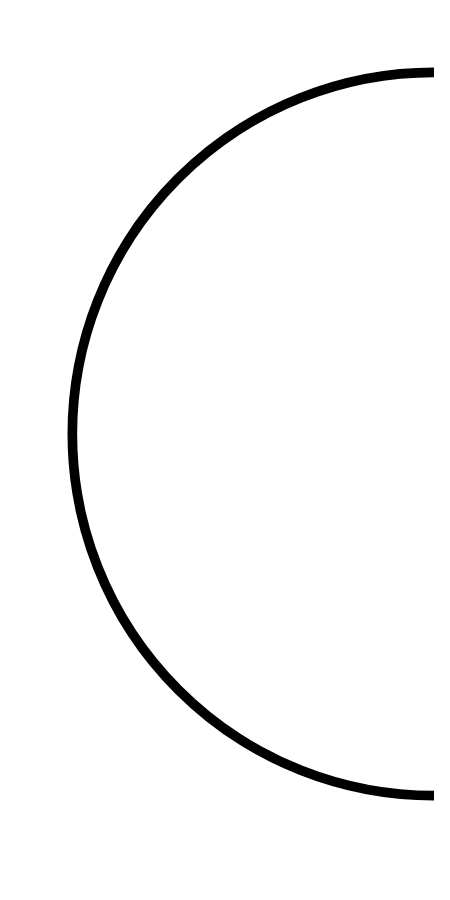

# Hasil

## Grafik

```mermaid
xychart-beta
    title "Perolehan Suara Nasional"
    x-axis []
    y-axis "Suara" 0 --> 0
    bar []
```



## Tabel

| No. | Nama Paslon | Suara | Suara (raw) | Persentase |
|:--- |:----------- | -----:| -----------:| ----------:|


[p-1]: https://github.com/gigit-pemilu/pemilu-2024/blob/main/pilpres/hitung-suara/sub/73-sulawesi-selatan/sub/71-kota-makassar/sub/01-mariso/sub/1005-panambungan/sub/005-tps/sub/paslon-1.txt
[p-2]: https://github.com/gigit-pemilu/pemilu-2024/blob/main/pilpres/hitung-suara/sub/73-sulawesi-selatan/sub/71-kota-makassar/sub/01-mariso/sub/1005-panambungan/sub/005-tps/sub/paslon-2.txt
[p-3]: https://github.com/gigit-pemilu/pemilu-2024/blob/main/pilpres/hitung-suara/sub/73-sulawesi-selatan/sub/71-kota-makassar/sub/01-mariso/sub/1005-panambungan/sub/005-tps/sub/paslon-3.txt

## Foto C Plano

https://sirekap-obj-formc.kpu.go.id/1596/pemilu/ppwp/73/71/01/10/05/7371011005005-20240221-194856--ee6db3cf-92c5-4988-8074-2f78d70390d9.jpg

https://sirekap-obj-formc.kpu.go.id/1596/pemilu/ppwp/73/71/01/10/05/7371011005005-20240221-195224--e1f4ff90-881a-477a-b741-25d902c34339.jpg

https://sirekap-obj-formc.kpu.go.id/1596/pemilu/ppwp/73/71/01/10/05/7371011005005-20240221-195310--47cb255b-f124-4a74-98fd-7fa1761d50e3.jpg


## Metadata

| Key        | Value               |
| ---------- | ------------------- |
| Time Stamp | 2024-02-21 20:00:00 |


## DATA PEMILIH TETAP

Jumlah pemilih dalam DPT: **0**.
 * L: **0**.
 * P: **0**.

## DATA PENGGUNA HAK PILIH

Jumlah pengguna hak pilih dalam DPT: **0**.
 * L: **0**.
 * P: **0**.

Jumlah pengguna hak pilih dalam DPTb: **33**.
 * L: **555**.
 * P: **0**.

Jumlah pengguna hak pilih dalam DPK: **25**.
 * L: **500**.
 * P: **57**.

Jumlah pengguna hak pilih: **192**.
 * L: **500**.
 * P: **785**.

## JUMLAH SUARA SAH DAN TIDAK SAH

JUMLAH SELURUH SUARA SAH: **191**.

JUMLAH SUARA TIDAK SAH: **0**.

JUMLAH SELURUH SUARA SAH DAN SUARA TIDAK SAH: **5**.


