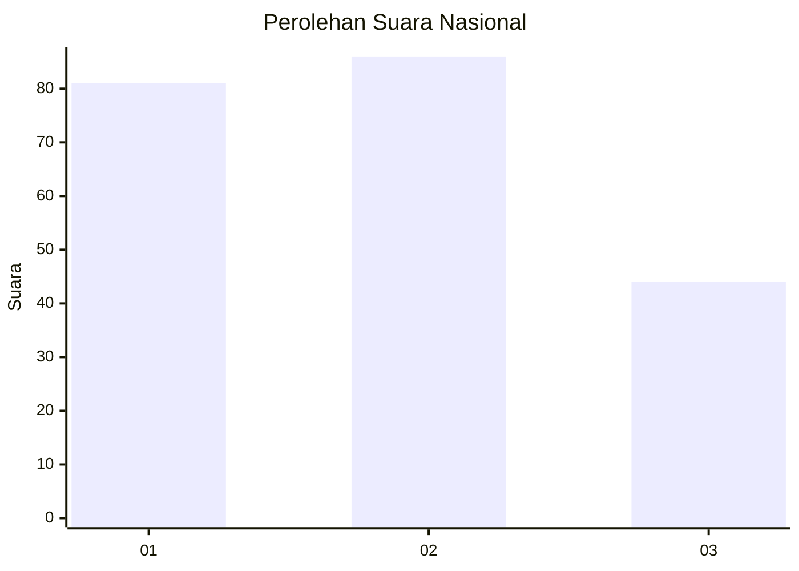
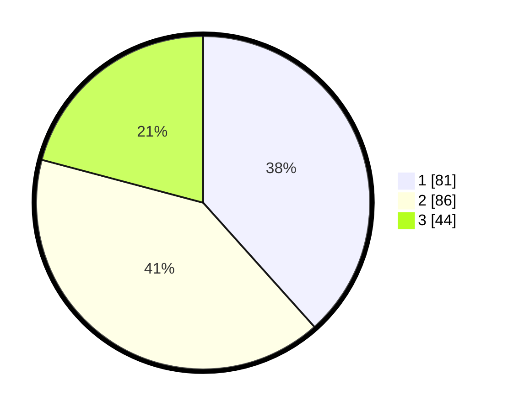

# Hasil

## Grafik

## Tabel

| No. | Nama Paslon    | Suara | Suara (raw) | Persentase |
|:--- |:-------------- | -----:| -----------:| ----------:|
| 1   | ANIES MUHAIMIN | 81    | [81][p-1]   | 38,39      |
| 2   | PRABOWO GIBRAN | 86    | [86][p-2]   | 40,76      |
| 3   | GANJAR MAHFUD  | 44    | [44][p-3]   | 20,85      |

[p-1]: https://github.com/gigit-pemilu/pemilu-2024/blob/main/pilpres/hitung-suara/sub/73-sulawesi-selatan/sub/71-kota-makassar/sub/01-mariso/sub/1005-panambungan/sub/018-tps/sub/paslon-1.txt
[p-2]: https://github.com/gigit-pemilu/pemilu-2024/blob/main/pilpres/hitung-suara/sub/73-sulawesi-selatan/sub/71-kota-makassar/sub/01-mariso/sub/1005-panambungan/sub/018-tps/sub/paslon-2.txt
[p-3]: https://github.com/gigit-pemilu/pemilu-2024/blob/main/pilpres/hitung-suara/sub/73-sulawesi-selatan/sub/71-kota-makassar/sub/01-mariso/sub/1005-panambungan/sub/018-tps/sub/paslon-3.txt

## Foto C Plano

https://sirekap-obj-formc.kpu.go.id/a0de/pemilu/ppwp/73/71/01/10/05/7371011005018-20240221-204401--598bc288-3024-49e3-8db0-1bb280f85d48.jpg

https://sirekap-obj-formc.kpu.go.id/a0de/pemilu/ppwp/73/71/01/10/05/7371011005018-20240221-204553--ff5d988f-e42d-4d18-aa34-a2e90057da7c.jpg

https://sirekap-obj-formc.kpu.go.id/a0de/pemilu/ppwp/73/71/01/10/05/7371011005018-20240221-204748--18fed9c6-7e7d-46bd-a8cc-73f3dda0f019.jpg

## Metadata

| Key        | Value               |
| ---------- | ------------------- |
| Time Stamp | 2024-02-21 21:00:04 |

## DATA PEMILIH TETAP

Jumlah pemilih dalam DPT: **760**.
 * L: **0**.
 * P: **5**.

## DATA PENGGUNA HAK PILIH

Jumlah pengguna hak pilih dalam DPT: **75**.
 * L: **0**.
 * P: **0**.

Jumlah pengguna hak pilih dalam DPTb: **3**.
 * L: **75**.
 * P: **7**.

Jumlah pengguna hak pilih dalam DPK: **3**.
 * L: **575**.
 * P: **1**.

Jumlah pengguna hak pilih: **418**.
 * L: **578**.
 * P: **709**.

## JUMLAH SUARA SAH DAN TIDAK SAH

JUMLAH SELURUH SUARA SAH: **176**.

JUMLAH SUARA TIDAK SAH: **5**.

JUMLAH SELURUH SUARA SAH DAN SUARA TIDAK SAH: **181**.

