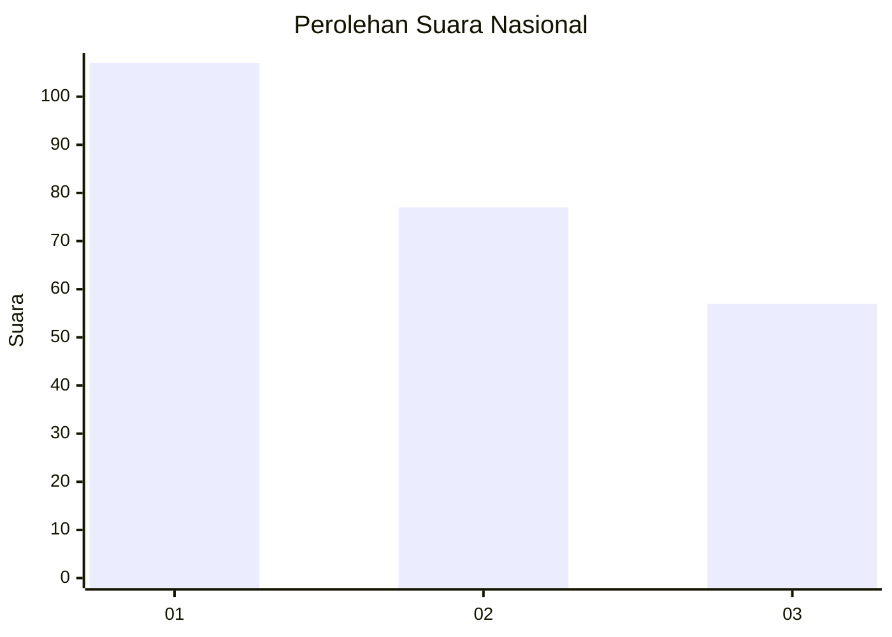
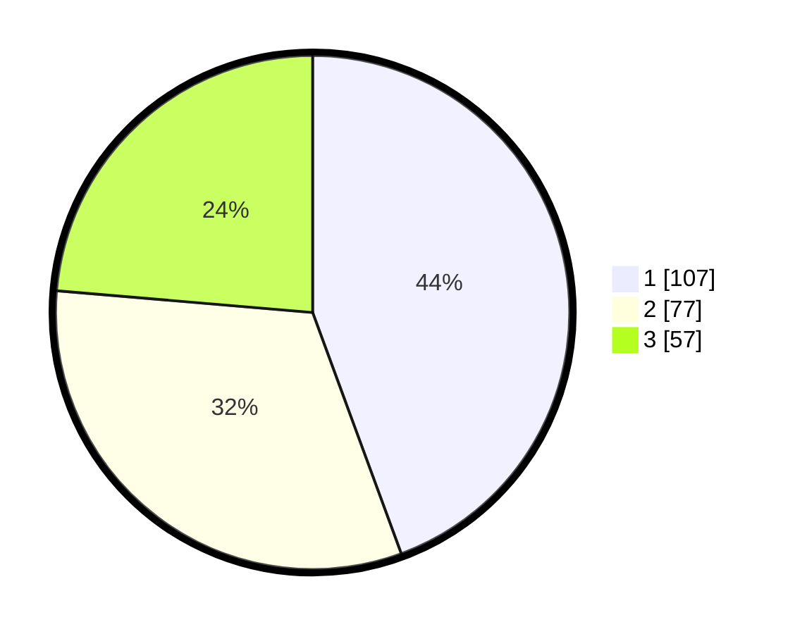

# Hasil

## Grafik

## Tabel

| No. | Nama Paslon    | Suara | Suara (raw) | Persentase |
|:--- |:-------------- | -----:| -----------:| ----------:|
| 1   | ANIES MUHAIMIN | 107   | [107][p-1]  | 44,40      |
| 2   | PRABOWO GIBRAN | 77    | [77][p-2]   | 31,95      |
| 3   | GANJAR MAHFUD  | 57    | [57][p-3]   | 23,65      |

[p-1]: https://github.com/gigit-pemilu/pemilu-2024/blob/main/pilpres/hitung-suara/sub/73-sulawesi-selatan/sub/71-kota-makassar/sub/01-mariso/sub/1005-panambungan/sub/019-tps/sub/paslon-1.txt
[p-2]: https://github.com/gigit-pemilu/pemilu-2024/blob/main/pilpres/hitung-suara/sub/73-sulawesi-selatan/sub/71-kota-makassar/sub/01-mariso/sub/1005-panambungan/sub/019-tps/sub/paslon-2.txt
[p-3]: https://github.com/gigit-pemilu/pemilu-2024/blob/main/pilpres/hitung-suara/sub/73-sulawesi-selatan/sub/71-kota-makassar/sub/01-mariso/sub/1005-panambungan/sub/019-tps/sub/paslon-3.txt

## Foto C Plano

https://sirekap-obj-formc.kpu.go.id/f048/pemilu/ppwp/73/71/01/10/05/7371011005019-20240221-203838--3f11d1c8-2b11-449b-bec9-9597a8498321.jpg

https://sirekap-obj-formc.kpu.go.id/f048/pemilu/ppwp/73/71/01/10/05/7371011005019-20240221-204106--47224d3a-a87a-480e-ad6a-d7c7484c8565.jpg

https://sirekap-obj-formc.kpu.go.id/f048/pemilu/ppwp/73/71/01/10/05/7371011005019-20240221-204227--60ce4051-d857-4601-b36b-15bb14ec53b3.jpg

## Metadata

| Key        | Value               |
| ---------- | ------------------- |
| Time Stamp | 2024-02-21 21:00:04 |

## DATA PEMILIH TETAP

Jumlah pemilih dalam DPT: **704**.
 * L: **126**.
 * P: **125**.

## DATA PENGGUNA HAK PILIH

Jumlah pengguna hak pilih dalam DPT: **44**.
 * L: **90**.
 * P: **98**.

Jumlah pengguna hak pilih dalam DPTb: **444**.
 * L: **2**.
 * P: **1**.

Jumlah pengguna hak pilih dalam DPK: **444**.
 * L: **0**.
 * P: **0**.

Jumlah pengguna hak pilih: **4**.
 * L: **92**.
 * P: **94**.

## JUMLAH SUARA SAH DAN TIDAK SAH

JUMLAH SELURUH SUARA SAH: **77**.

JUMLAH SUARA TIDAK SAH: **777**.

JUMLAH SELURUH SUARA SAH DAN SUARA TIDAK SAH: **777**.

