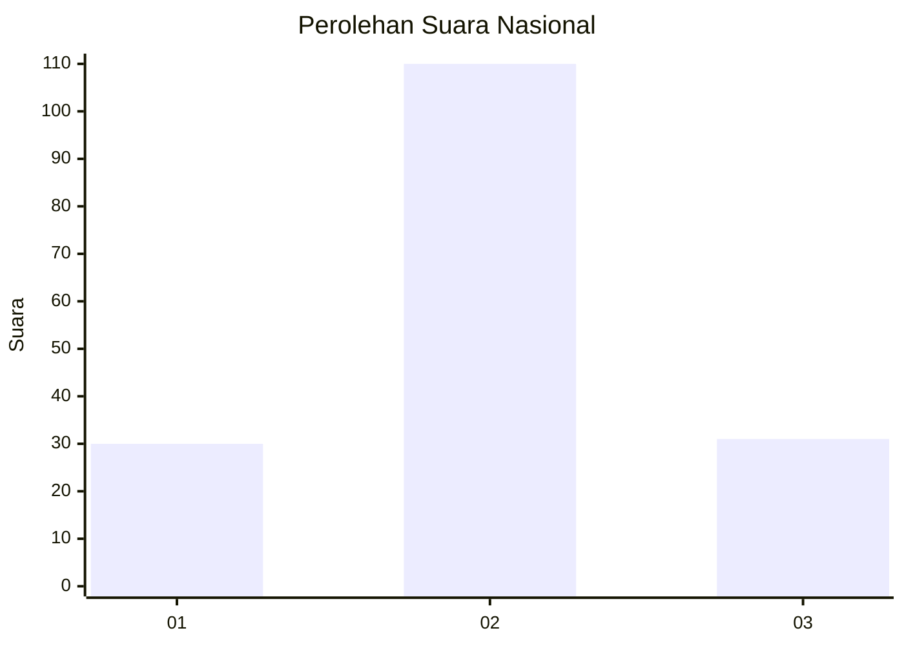
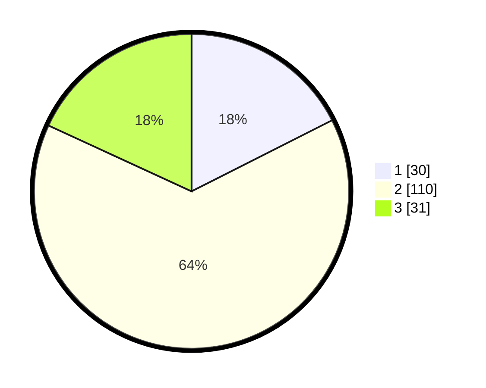

# Hasil

## Grafik

## Tabel

| No. | Nama Paslon    | Suara | Suara (raw) | Persentase |
|:--- |:-------------- | -----:| -----------:| ----------:|
| 1   | ANIES MUHAIMIN | 30    | [30][p-1]   | 17,54      |
| 2   | PRABOWO GIBRAN | 110   | [110][p-2]  | 64,33      |
| 3   | GANJAR MAHFUD  | 31    | [31][p-3]   | 18,13      |

[p-1]: https://github.com/gigit-pemilu/pemilu-2024/blob/main/pilpres/hitung-suara/sub/73-sulawesi-selatan/sub/71-kota-makassar/sub/01-mariso/sub/1006-mariso/sub/005-tps/sub/paslon-1.txt
[p-2]: https://github.com/gigit-pemilu/pemilu-2024/blob/main/pilpres/hitung-suara/sub/73-sulawesi-selatan/sub/71-kota-makassar/sub/01-mariso/sub/1006-mariso/sub/005-tps/sub/paslon-2.txt
[p-3]: https://github.com/gigit-pemilu/pemilu-2024/blob/main/pilpres/hitung-suara/sub/73-sulawesi-selatan/sub/71-kota-makassar/sub/01-mariso/sub/1006-mariso/sub/005-tps/sub/paslon-3.txt

## Foto C Plano

https://sirekap-obj-formc.kpu.go.id/c6ee/pemilu/ppwp/73/71/01/10/06/7371011006005-20240225-125444--abc3f12e-e824-428a-811a-41f0f537ae75.jpg

https://sirekap-obj-formc.kpu.go.id/c6ee/pemilu/ppwp/73/71/01/10/06/7371011006005-20240225-125507--7f52d8ac-dd7a-4b17-a0c3-4300630545b2.jpg

https://sirekap-obj-formc.kpu.go.id/c6ee/pemilu/ppwp/73/71/01/10/06/7371011006005-20240225-125527--e49b21ca-9d44-45bf-a172-f33b3189aefc.jpg

## Metadata

| Key        | Value               |
| ---------- | ------------------- |
| Time Stamp | 2024-02-25 17:00:00 |

## DATA PEMILIH TETAP

Jumlah pemilih dalam DPT: **258**.
 * L: **121**.
 * P: **137**.

## DATA PENGGUNA HAK PILIH

Jumlah pengguna hak pilih dalam DPT: **225**.
 * L: **35**.
 * P: **835**.

Jumlah pengguna hak pilih dalam DPTb: **25**.
 * L: **0**.
 * P: **155**.

Jumlah pengguna hak pilih dalam DPK: **0**.
 * L: **550**.
 * P: **550**.

Jumlah pengguna hak pilih: **117**.
 * L: **0**.
 * P: **546**.

## JUMLAH SUARA SAH DAN TIDAK SAH

JUMLAH SELURUH SUARA SAH: **171**.

JUMLAH SUARA TIDAK SAH: **2**.

JUMLAH SELURUH SUARA SAH DAN SUARA TIDAK SAH: **173**.

