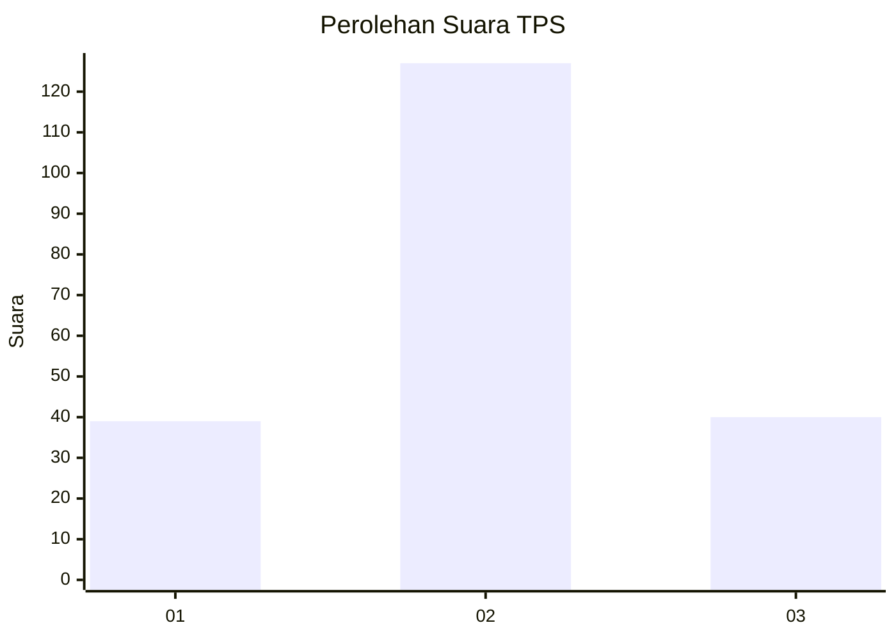
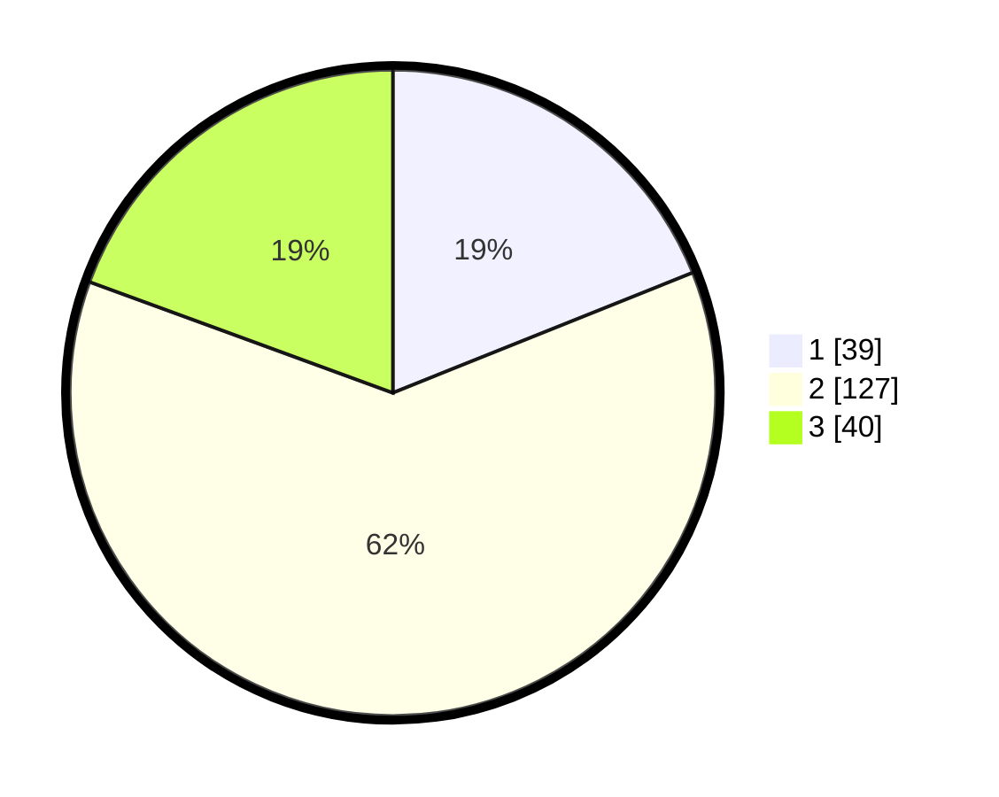

# Hasil

## Grafik

## Tabel

| No. | Nama Paslon    | Suara | Suara (raw) | Persentase |
|:--- |:-------------- | -----:| -----------:| ----------:|
| 1   | ANIES MUHAIMIN | 39    | [39][p-1]   | 18,93      |
| 2   | PRABOWO GIBRAN | 127   | [127][p-2]  | 61,65      |
| 3   | GANJAR MAHFUD  | 40    | [40][p-3]   | 19,42      |

[p-1]: https://github.com/gigit-pemilu/pemilu-2024-73-sulawesi-selatan/blob/main/pilpres/hitung-suara/sub/73-sulawesi-selatan/sub/71-kota-makassar/sub/01-mariso/sub/1006-mariso/sub/007-tps/sub/paslon-1.txt
[p-2]: https://github.com/gigit-pemilu/pemilu-2024-73-sulawesi-selatan/blob/main/pilpres/hitung-suara/sub/73-sulawesi-selatan/sub/71-kota-makassar/sub/01-mariso/sub/1006-mariso/sub/007-tps/sub/paslon-2.txt
[p-3]: https://github.com/gigit-pemilu/pemilu-2024-73-sulawesi-selatan/blob/main/pilpres/hitung-suara/sub/73-sulawesi-selatan/sub/71-kota-makassar/sub/01-mariso/sub/1006-mariso/sub/007-tps/sub/paslon-3.txt

## Foto C Plano

https://sirekap-obj-formc.kpu.go.id/17ac/pemilu/ppwp/73/71/01/10/06/7371011006007-20240226-135958--fbd64537-10a9-4d2a-ae2e-d245abe35dce.jpg

https://sirekap-obj-formc.kpu.go.id/17ac/pemilu/ppwp/73/71/01/10/06/7371011006007-20240226-140043--2f74b8f8-3d65-44cf-8485-eb6db5d8b42c.jpg

https://sirekap-obj-formc.kpu.go.id/17ac/pemilu/ppwp/73/71/01/10/06/7371011006007-20240226-140131--ab8b515e-d007-4703-8674-6fc693a9b417.jpg

## Metadata

| Key        | Value               |
| ---------- | ------------------- |
| Time Stamp | 2024-02-26 19:00:00 |

## DATA PEMILIH TETAP

Jumlah pemilih dalam DPT: **208**.
 * L: **882**.
 * P: **885**.

## DATA PENGGUNA HAK PILIH

Jumlah pengguna hak pilih dalam DPT: **550**.
 * L: **57**.
 * P: **557**.

Jumlah pengguna hak pilih dalam DPTb: **224**.
 * L: **0**.
 * P: **2**.

Jumlah pengguna hak pilih dalam DPK: **444**.
 * L: **22**.
 * P: **240**.

Jumlah pengguna hak pilih: **721**.
 * L: **777**.
 * P: **227**.

## JUMLAH SUARA SAH DAN TIDAK SAH

JUMLAH SELURUH SUARA SAH: **206**.

JUMLAH SUARA TIDAK SAH: **4**.

JUMLAH SELURUH SUARA SAH DAN SUARA TIDAK SAH: **210**.

