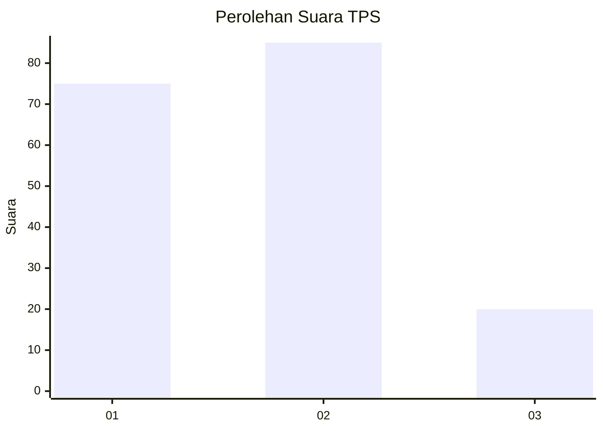
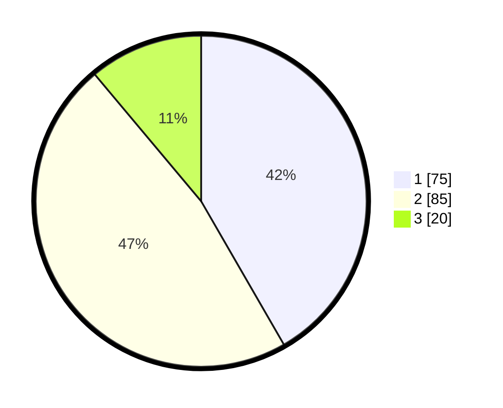

# Hasil

## Grafik

## Tabel

| No. | Nama Paslon    | Suara | Suara (raw) | Persentase |
|:--- |:-------------- | -----:| -----------:| ----------:|
| 1   | ANIES MUHAIMIN | 75    | [75][p-1]   | 41,67      |
| 2   | PRABOWO GIBRAN | 85    | [85][p-2]   | 47,22      |
| 3   | GANJAR MAHFUD  | 20    | [20][p-3]   | 11,11      |

[p-1]: https://github.com/gigit-pemilu/pemilu-2024-73-sulawesi-selatan/blob/main/pilpres/hitung-suara/sub/73-sulawesi-selatan/sub/71-kota-makassar/sub/01-mariso/sub/1007-mario/sub/002-tps/sub/paslon-1.txt
[p-2]: https://github.com/gigit-pemilu/pemilu-2024-73-sulawesi-selatan/blob/main/pilpres/hitung-suara/sub/73-sulawesi-selatan/sub/71-kota-makassar/sub/01-mariso/sub/1007-mario/sub/002-tps/sub/paslon-2.txt
[p-3]: https://github.com/gigit-pemilu/pemilu-2024-73-sulawesi-selatan/blob/main/pilpres/hitung-suara/sub/73-sulawesi-selatan/sub/71-kota-makassar/sub/01-mariso/sub/1007-mario/sub/002-tps/sub/paslon-3.txt

## Foto C Plano

https://sirekap-obj-formc.kpu.go.id/38cf/pemilu/ppwp/73/71/01/10/07/7371011007002-20240224-211118--123bdb10-881c-41f3-a777-a20f9d48b9c5.jpg

https://sirekap-obj-formc.kpu.go.id/38cf/pemilu/ppwp/73/71/01/10/07/7371011007002-20240224-211140--8b1e4ce1-8390-437d-a015-7077b0cabf34.jpg

https://sirekap-obj-formc.kpu.go.id/38cf/pemilu/ppwp/73/71/01/10/07/7371011007002-20240224-211215--9dbe140f-23a5-43a5-95e4-22f157e4f622.jpg

## Metadata

| Key        | Value               |
| ---------- | ------------------- |
| Time Stamp | 2024-02-24 23:00:00 |

## DATA PEMILIH TETAP

Jumlah pemilih dalam DPT: **611**.
 * L: **754**.
 * P: **445**.

## DATA PENGGUNA HAK PILIH

Jumlah pengguna hak pilih dalam DPT: **760**.
 * L: **444**.
 * P: **64**.

Jumlah pengguna hak pilih dalam DPTb: **261**.
 * L: **444**.
 * P: **224**.

Jumlah pengguna hak pilih dalam DPK: **41**.
 * L: **444**.
 * P: **616**.

Jumlah pengguna hak pilih: **801**.
 * L: **444**.
 * P: **274**.

## JUMLAH SUARA SAH DAN TIDAK SAH

JUMLAH SELURUH SUARA SAH: **180**.

JUMLAH SUARA TIDAK SAH: **0**.

JUMLAH SELURUH SUARA SAH DAN SUARA TIDAK SAH: **180**.

