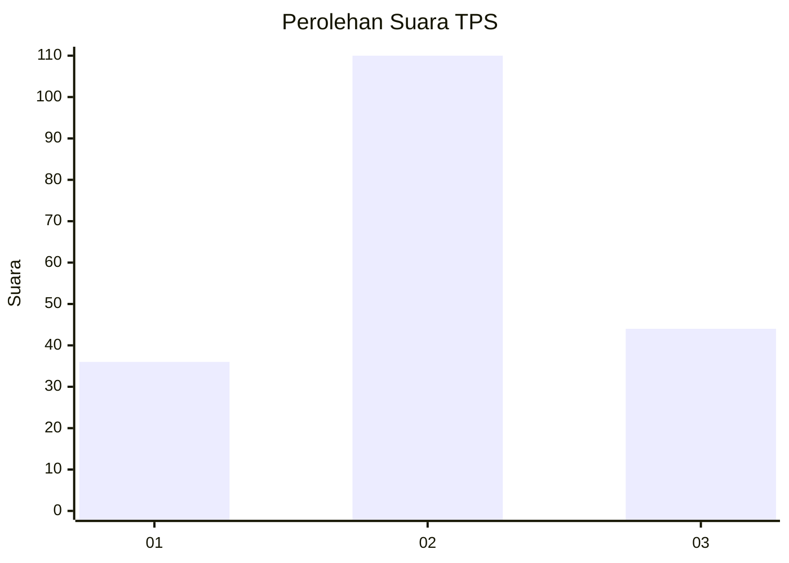
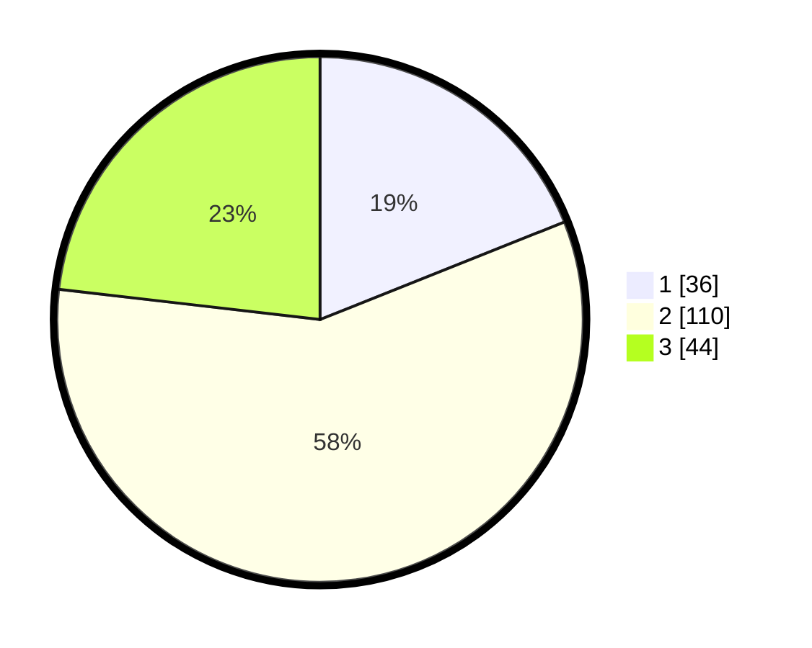

# Hasil

## Grafik

## Tabel

| No. | Nama Paslon    | Suara | Suara (raw) | Persentase |
|:--- |:-------------- | -----:| -----------:| ----------:|
| 1   | ANIES MUHAIMIN | 36    | [36][p-1]   | 18,95      |
| 2   | PRABOWO GIBRAN | 110   | [110][p-2]  | 57,89      |
| 3   | GANJAR MAHFUD  | 44    | [44][p-3]   | 23,16      |

[p-1]: https://github.com/gigit-pemilu/pemilu-2024-73-sulawesi-selatan/blob/main/pilpres/hitung-suara/sub/73-sulawesi-selatan/sub/71-kota-makassar/sub/01-mariso/sub/1007-mario/sub/003-tps/sub/paslon-1.txt
[p-2]: https://github.com/gigit-pemilu/pemilu-2024-73-sulawesi-selatan/blob/main/pilpres/hitung-suara/sub/73-sulawesi-selatan/sub/71-kota-makassar/sub/01-mariso/sub/1007-mario/sub/003-tps/sub/paslon-2.txt
[p-3]: https://github.com/gigit-pemilu/pemilu-2024-73-sulawesi-selatan/blob/main/pilpres/hitung-suara/sub/73-sulawesi-selatan/sub/71-kota-makassar/sub/01-mariso/sub/1007-mario/sub/003-tps/sub/paslon-3.txt

## Foto C Plano

https://sirekap-obj-formc.kpu.go.id/b957/pemilu/ppwp/73/71/01/10/07/7371011007003-20240224-214644--887d4aed-cedc-467a-b6fd-53a674064b81.jpg

https://sirekap-obj-formc.kpu.go.id/b957/pemilu/ppwp/73/71/01/10/07/7371011007003-20240224-214732--cfa01100-2744-4eb3-bf30-620740e04727.jpg

https://sirekap-obj-formc.kpu.go.id/b957/pemilu/ppwp/73/71/01/10/07/7371011007003-20240224-214834--07fe61f4-b214-404f-bf3c-721cea641b0c.jpg

## Metadata

| Key        | Value               |
| ---------- | ------------------- |
| Time Stamp | 2024-02-25 12:00:00 |

## DATA PEMILIH TETAP

Jumlah pemilih dalam DPT: **251**.
 * L: **75**.
 * P: **571**.

## DATA PENGGUNA HAK PILIH

Jumlah pengguna hak pilih dalam DPT: **757**.
 * L: **80**.
 * P: **102**.

Jumlah pengguna hak pilih dalam DPTb: **777**.
 * L: **0**.
 * P: **2**.

Jumlah pengguna hak pilih dalam DPK: **777**.
 * L: **3**.
 * P: **4**.

Jumlah pengguna hak pilih: **777**.
 * L: **83**.
 * P: **108**.

## JUMLAH SUARA SAH DAN TIDAK SAH

JUMLAH SELURUH SUARA SAH: **190**.

JUMLAH SUARA TIDAK SAH: **1**.

JUMLAH SELURUH SUARA SAH DAN SUARA TIDAK SAH: **191**.

