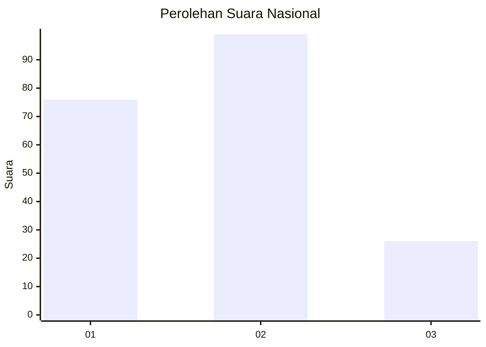
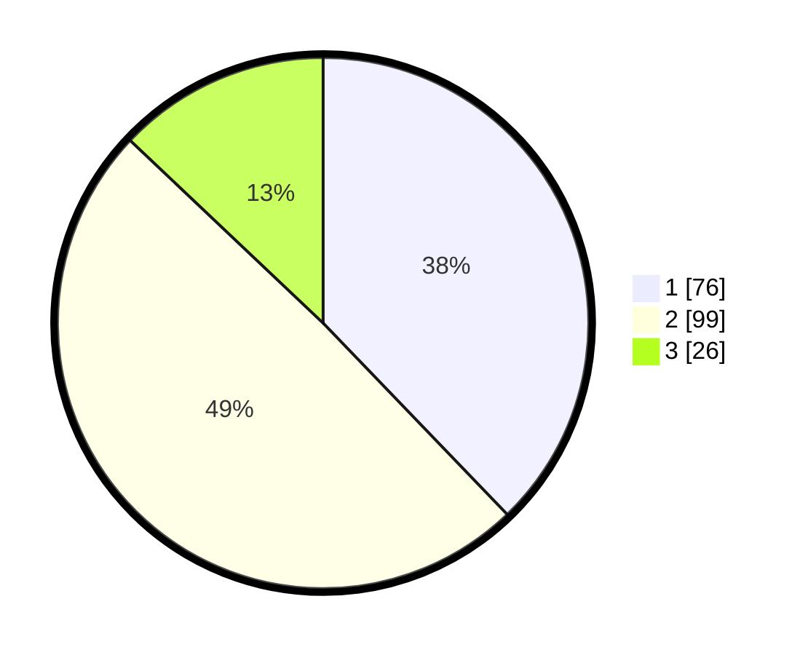

# Hasil

## Grafik

## Tabel

| No. | Nama Paslon    | Suara | Suara (raw) | Persentase |
|:--- |:-------------- | -----:| -----------:| ----------:|
| 1   | ANIES MUHAIMIN | 76    | [76][p-1]   | 37,81      |
| 2   | PRABOWO GIBRAN | 99    | [99][p-2]   | 49,25      |
| 3   | GANJAR MAHFUD  | 26    | [26][p-3]   | 12,94      |

[p-1]: https://github.com/gigit-pemilu/pemilu-2024/blob/main/pilpres/hitung-suara/sub/73-sulawesi-selatan/sub/71-kota-makassar/sub/03-makassar/sub/1001-maricaya/sub/005-tps/sub/paslon-1.txt
[p-2]: https://github.com/gigit-pemilu/pemilu-2024/blob/main/pilpres/hitung-suara/sub/73-sulawesi-selatan/sub/71-kota-makassar/sub/03-makassar/sub/1001-maricaya/sub/005-tps/sub/paslon-2.txt
[p-3]: https://github.com/gigit-pemilu/pemilu-2024/blob/main/pilpres/hitung-suara/sub/73-sulawesi-selatan/sub/71-kota-makassar/sub/03-makassar/sub/1001-maricaya/sub/005-tps/sub/paslon-3.txt

## Foto C Plano

https://sirekap-obj-formc.kpu.go.id/8f14/pemilu/ppwp/73/71/03/10/01/7371031001005-20240215-145511--3e0610fc-a1f4-4b2b-a8d9-3ce66dd46797.jpg

https://sirekap-obj-formc.kpu.go.id/8f14/pemilu/ppwp/73/71/03/10/01/7371031001005-20240215-214707--5e6d7379-1a57-4f6e-b631-6a1a5177a0bb.jpg

https://sirekap-obj-formc.kpu.go.id/8f14/pemilu/ppwp/73/71/03/10/01/7371031001005-20240215-150343--7c50b460-a9e7-4e4e-87c7-fd740abf814b.jpg

## Metadata

| Key        | Value               |
| ---------- | ------------------- |
| Time Stamp | 2024-02-15 22:30:27 |

