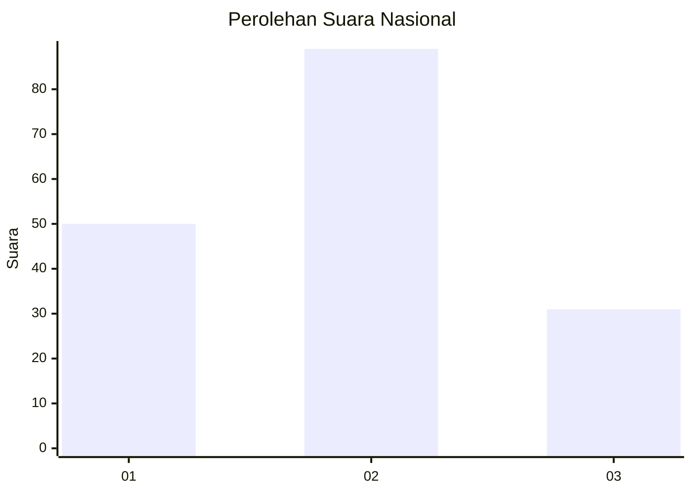
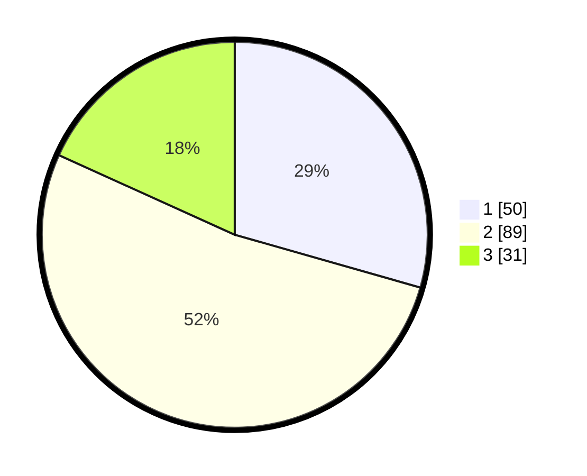

# Hasil

## Grafik

## Tabel

| No. | Nama Paslon    | Suara | Suara (raw) | Persentase |
|:--- |:-------------- | -----:| -----------:| ----------:|
| 1   | ANIES MUHAIMIN | 50    | [50][p-1]   | 29,41      |
| 2   | PRABOWO GIBRAN | 89    | [89][p-2]   | 52,35      |
| 3   | GANJAR MAHFUD  | 31    | [31][p-3]   | 18,24      |

[p-1]: https://github.com/gigit-pemilu/pemilu-2024/blob/main/pilpres/hitung-suara/sub/73-sulawesi-selatan/sub/71-kota-makassar/sub/04-ujung-pandang/sub/1001-maloku/sub/005-tps/sub/paslon-1.txt
[p-2]: https://github.com/gigit-pemilu/pemilu-2024/blob/main/pilpres/hitung-suara/sub/73-sulawesi-selatan/sub/71-kota-makassar/sub/04-ujung-pandang/sub/1001-maloku/sub/005-tps/sub/paslon-2.txt
[p-3]: https://github.com/gigit-pemilu/pemilu-2024/blob/main/pilpres/hitung-suara/sub/73-sulawesi-selatan/sub/71-kota-makassar/sub/04-ujung-pandang/sub/1001-maloku/sub/005-tps/sub/paslon-3.txt

## Foto C Plano

https://sirekap-obj-formc.kpu.go.id/6b81/pemilu/ppwp/73/71/04/10/01/7371041001005-20240215-015034--7f4e4953-ea1b-47df-a013-71a669e47701.jpg

https://sirekap-obj-formc.kpu.go.id/6b81/pemilu/ppwp/73/71/04/10/01/7371041001005-20240215-015219--68968475-42ef-4d67-8141-5e53051e3460.jpg

https://sirekap-obj-formc.kpu.go.id/6b81/pemilu/ppwp/73/71/04/10/01/7371041001005-20240215-015538--fc524133-38d9-4239-9eb0-f3188383b306.jpg

## Metadata

| Key        | Value               |
| ---------- | ------------------- |
| Time Stamp | 2024-02-15 15:00:29 |

