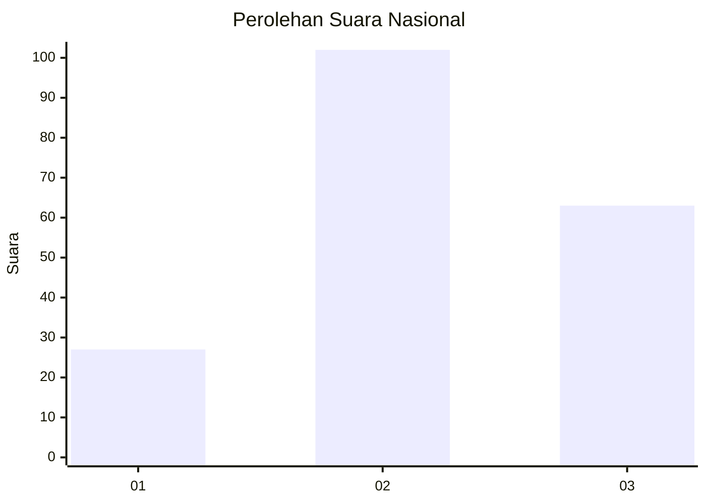
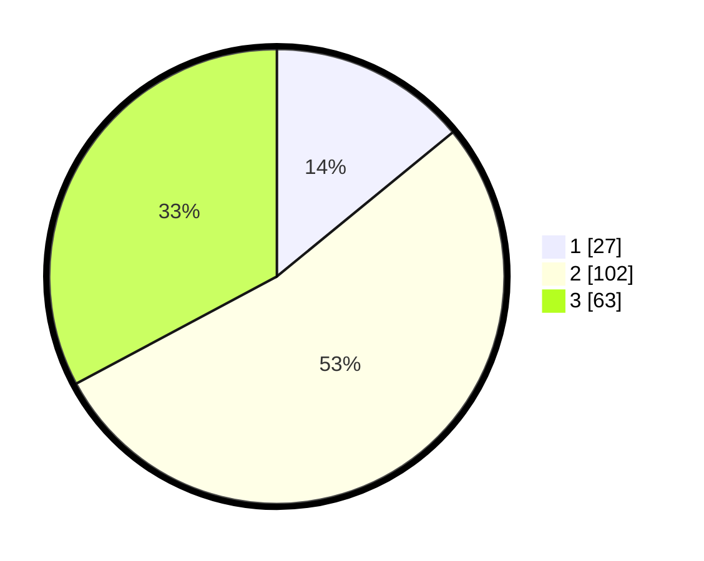

# Hasil

## Grafik

## Tabel

| No. | Nama Paslon    | Suara | Suara (raw) | Persentase |
|:--- |:-------------- | -----:| -----------:| ----------:|
| 1   | ANIES MUHAIMIN | 27    | [27][p-1]   | 14,06      |
| 2   | PRABOWO GIBRAN | 102   | [102][p-2]  | 53,13      |
| 3   | GANJAR MAHFUD  | 63    | [63][p-3]   | 32,81      |

[p-1]: https://github.com/gigit-pemilu/pemilu-2024/blob/main/pilpres/hitung-suara/sub/73-sulawesi-selatan/sub/71-kota-makassar/sub/05-wajo/sub/1001-pattunuang/sub/010-tps/sub/paslon-1.txt
[p-2]: https://github.com/gigit-pemilu/pemilu-2024/blob/main/pilpres/hitung-suara/sub/73-sulawesi-selatan/sub/71-kota-makassar/sub/05-wajo/sub/1001-pattunuang/sub/010-tps/sub/paslon-2.txt
[p-3]: https://github.com/gigit-pemilu/pemilu-2024/blob/main/pilpres/hitung-suara/sub/73-sulawesi-selatan/sub/71-kota-makassar/sub/05-wajo/sub/1001-pattunuang/sub/010-tps/sub/paslon-3.txt

## Foto C Plano

https://sirekap-obj-formc.kpu.go.id/5d62/pemilu/ppwp/73/71/05/10/01/7371051001010-20240215-031420--771970a6-c769-45f8-aa81-98ea32e29aca.jpg

https://sirekap-obj-formc.kpu.go.id/5d62/pemilu/ppwp/73/71/05/10/01/7371051001010-20240215-031435--e6bc2432-b568-4d6f-8292-09d9923f2698.jpg

https://sirekap-obj-formc.kpu.go.id/5d62/pemilu/ppwp/73/71/05/10/01/7371051001010-20240215-031452--6fdd11db-d414-43b5-881f-91d6b22776cf.jpg

## Metadata

| Key        | Value               |
| ---------- | ------------------- |
| Time Stamp | 2024-02-15 15:00:29 |

