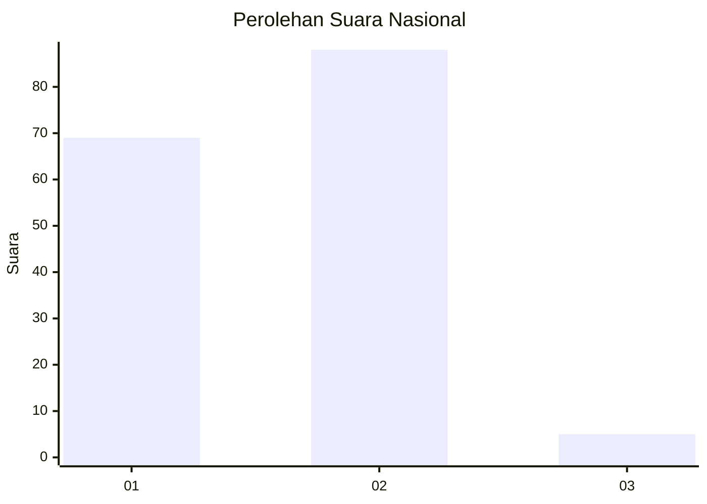
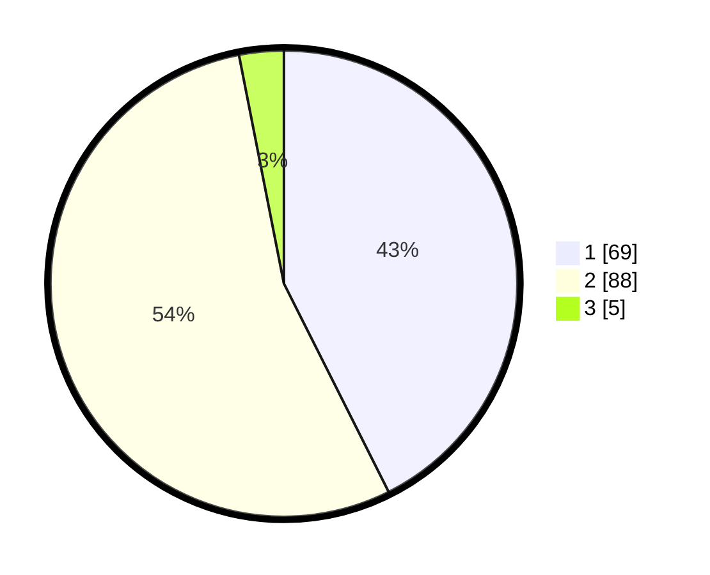

# Hasil

## Grafik

## Tabel

| No. | Nama Paslon    | Suara | Suara (raw) | Persentase |
|:--- |:-------------- | -----:| -----------:| ----------:|
| 1   | ANIES MUHAIMIN | 69    | [69][p-1]   | 42,59      |
| 2   | PRABOWO GIBRAN | 88    | [88][p-2]   | 54,32      |
| 3   | GANJAR MAHFUD  | 5     | [5][p-3]    | 3,09       |

[p-1]: https://github.com/gigit-pemilu/pemilu-2024/blob/main/pilpres/hitung-suara/sub/73-sulawesi-selatan/sub/71-kota-makassar/sub/07-tallo/sub/1001-pannampu/sub/006-tps/sub/paslon-1.txt
[p-2]: https://github.com/gigit-pemilu/pemilu-2024/blob/main/pilpres/hitung-suara/sub/73-sulawesi-selatan/sub/71-kota-makassar/sub/07-tallo/sub/1001-pannampu/sub/006-tps/sub/paslon-2.txt
[p-3]: https://github.com/gigit-pemilu/pemilu-2024/blob/main/pilpres/hitung-suara/sub/73-sulawesi-selatan/sub/71-kota-makassar/sub/07-tallo/sub/1001-pannampu/sub/006-tps/sub/paslon-3.txt

## Foto C Plano

https://sirekap-obj-formc.kpu.go.id/e00b/pemilu/ppwp/73/71/07/10/01/7371071001006-20240215-020443--6362d1f9-b171-4294-8b1e-b93ca38c5341.jpg

https://sirekap-obj-formc.kpu.go.id/e00b/pemilu/ppwp/73/71/07/10/01/7371071001006-20240215-105829--bcbba68a-bacd-483b-941c-400d704be837.jpg

https://sirekap-obj-formc.kpu.go.id/e00b/pemilu/ppwp/73/71/07/10/01/7371071001006-20240215-105838--2ed3c6f7-32c2-40fb-b987-87b5833faa8a.jpg

## Metadata

| Key        | Value               |
| ---------- | ------------------- |
| Time Stamp | 2024-02-15 15:00:29 |

