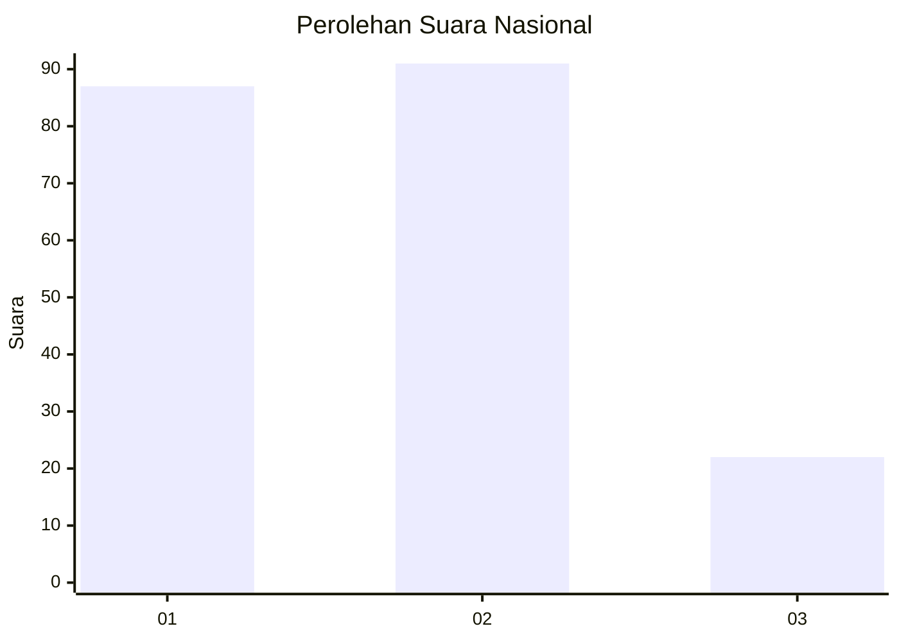
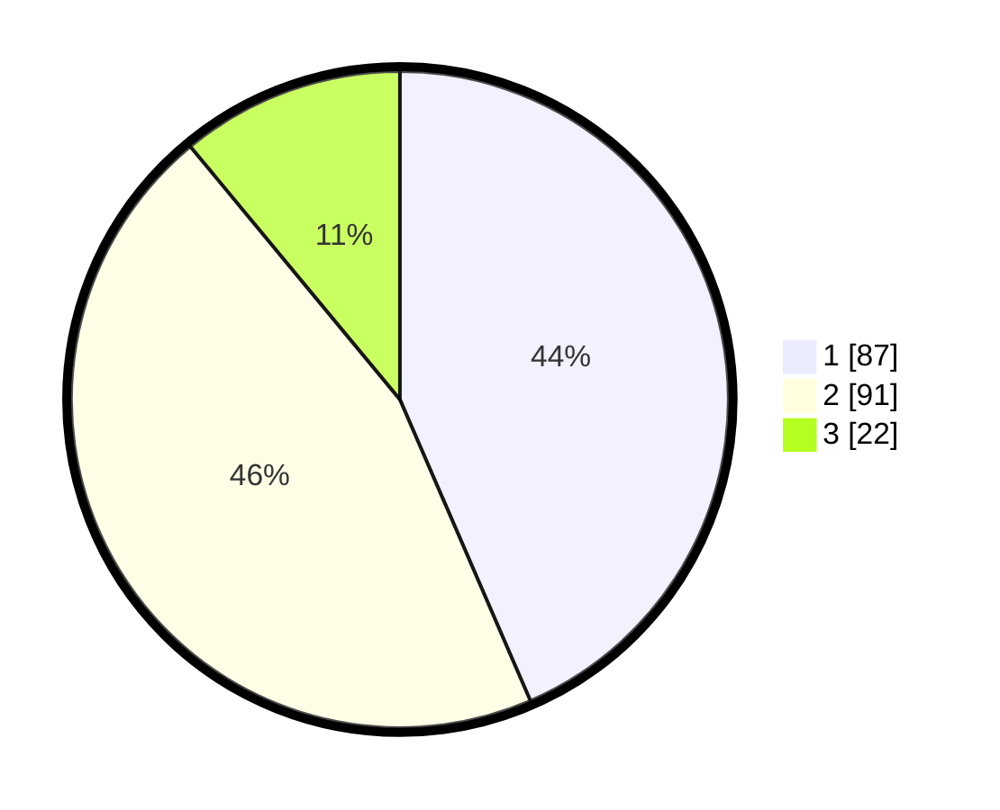

# Hasil

## Grafik

## Tabel

| No. | Nama Paslon    | Suara | Suara (raw) | Persentase |
|:--- |:-------------- | -----:| -----------:| ----------:|
| 1   | ANIES MUHAIMIN | 87    | [87][p-1]   | 43,50      |
| 2   | PRABOWO GIBRAN | 91    | [91][p-2]   | 45,50      |
| 3   | GANJAR MAHFUD  | 22    | [22][p-3]   | 11,00      |

[p-1]: https://github.com/gigit-pemilu/pemilu-2024/blob/main/pilpres/hitung-suara/sub/73-sulawesi-selatan/sub/71-kota-makassar/sub/09-panakkukang/sub/1001-karuwisi/sub/002-tps/sub/paslon-1.txt
[p-2]: https://github.com/gigit-pemilu/pemilu-2024/blob/main/pilpres/hitung-suara/sub/73-sulawesi-selatan/sub/71-kota-makassar/sub/09-panakkukang/sub/1001-karuwisi/sub/002-tps/sub/paslon-2.txt
[p-3]: https://github.com/gigit-pemilu/pemilu-2024/blob/main/pilpres/hitung-suara/sub/73-sulawesi-selatan/sub/71-kota-makassar/sub/09-panakkukang/sub/1001-karuwisi/sub/002-tps/sub/paslon-3.txt

## Foto C Plano

https://sirekap-obj-formc.kpu.go.id/4eae/pemilu/ppwp/73/71/09/10/01/7371091001002-20240214-233840--99b567be-b89a-4938-897d-8a5cbea04041.jpg

https://sirekap-obj-formc.kpu.go.id/4eae/pemilu/ppwp/73/71/09/10/01/7371091001002-20240215-000212--1a25f233-3446-429d-bd65-f07e38f5775e.jpg

https://sirekap-obj-formc.kpu.go.id/4eae/pemilu/ppwp/73/71/09/10/01/7371091001002-20240214-235800--5100a2dd-e416-4796-aeaf-055db3b462a0.jpg

## Metadata

| Key        | Value               |
| ---------- | ------------------- |
| Time Stamp | 2024-02-15 15:00:29 |

