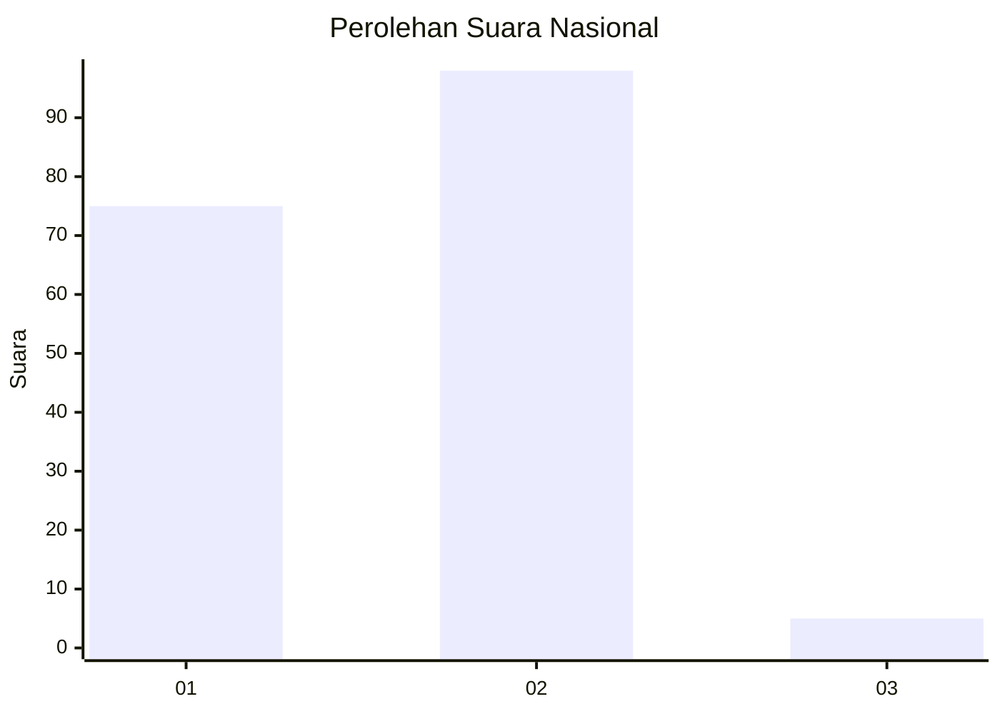
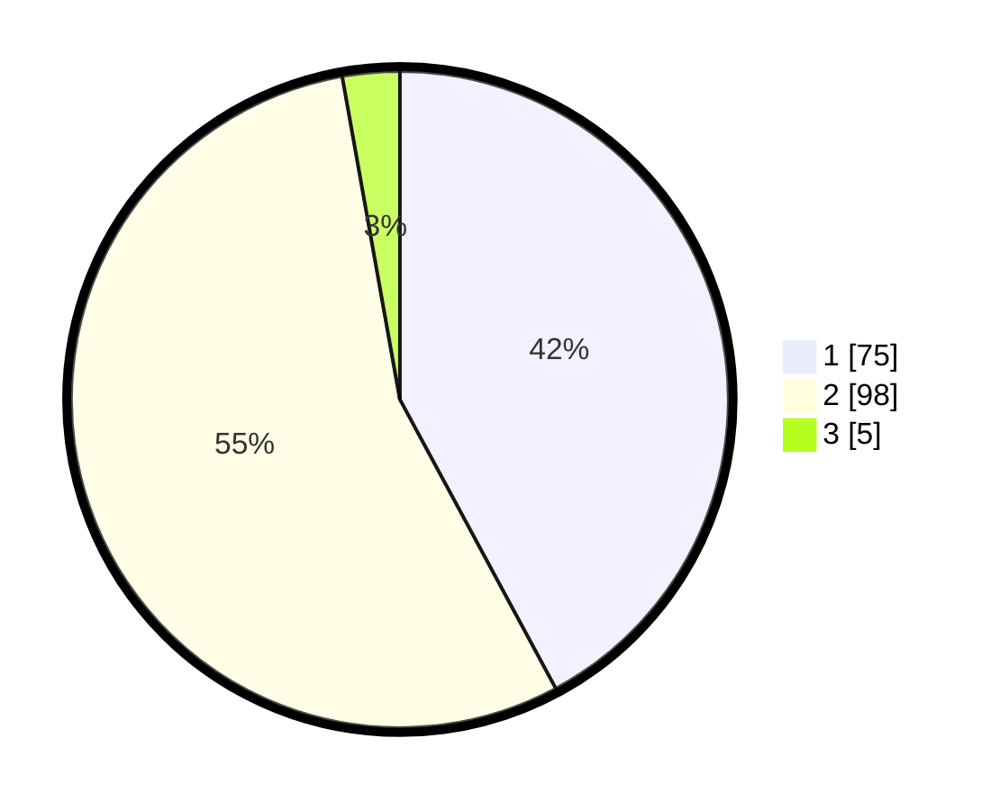

# Hasil

## Grafik

## Tabel

| No. | Nama Paslon    | Suara | Suara (raw) | Persentase |
|:--- |:-------------- | -----:| -----------:| ----------:|
| 1   | ANIES MUHAIMIN | 75    | [75][p-1]   | 42,13      |
| 2   | PRABOWO GIBRAN | 98    | [98][p-2]   | 55,06      |
| 3   | GANJAR MAHFUD  | 5     | [5][p-3]    | 2,81       |

[p-1]: https://github.com/gigit-pemilu/pemilu-2024/blob/main/pilpres/hitung-suara/sub/73-sulawesi-selatan/sub/71-kota-makassar/sub/09-panakkukang/sub/1001-karuwisi/sub/006-tps/sub/paslon-1.txt
[p-2]: https://github.com/gigit-pemilu/pemilu-2024/blob/main/pilpres/hitung-suara/sub/73-sulawesi-selatan/sub/71-kota-makassar/sub/09-panakkukang/sub/1001-karuwisi/sub/006-tps/sub/paslon-2.txt
[p-3]: https://github.com/gigit-pemilu/pemilu-2024/blob/main/pilpres/hitung-suara/sub/73-sulawesi-selatan/sub/71-kota-makassar/sub/09-panakkukang/sub/1001-karuwisi/sub/006-tps/sub/paslon-3.txt

## Foto C Plano

https://sirekap-obj-formc.kpu.go.id/e26a/pemilu/ppwp/73/71/09/10/01/7371091001006-20240214-235248--aaf25dc5-0b9f-402e-99cd-d0b29b60c1e8.jpg

https://sirekap-obj-formc.kpu.go.id/e26a/pemilu/ppwp/73/71/09/10/01/7371091001006-20240215-001240--faa5dab5-018d-4c4c-a00c-473d3363350f.jpg

https://sirekap-obj-formc.kpu.go.id/e26a/pemilu/ppwp/73/71/09/10/01/7371091001006-20240215-004224--4f3bdfff-3db1-4a17-8d52-a344e3e63201.jpg

## Metadata

| Key        | Value               |
| ---------- | ------------------- |
| Time Stamp | 2024-02-15 15:00:29 |

