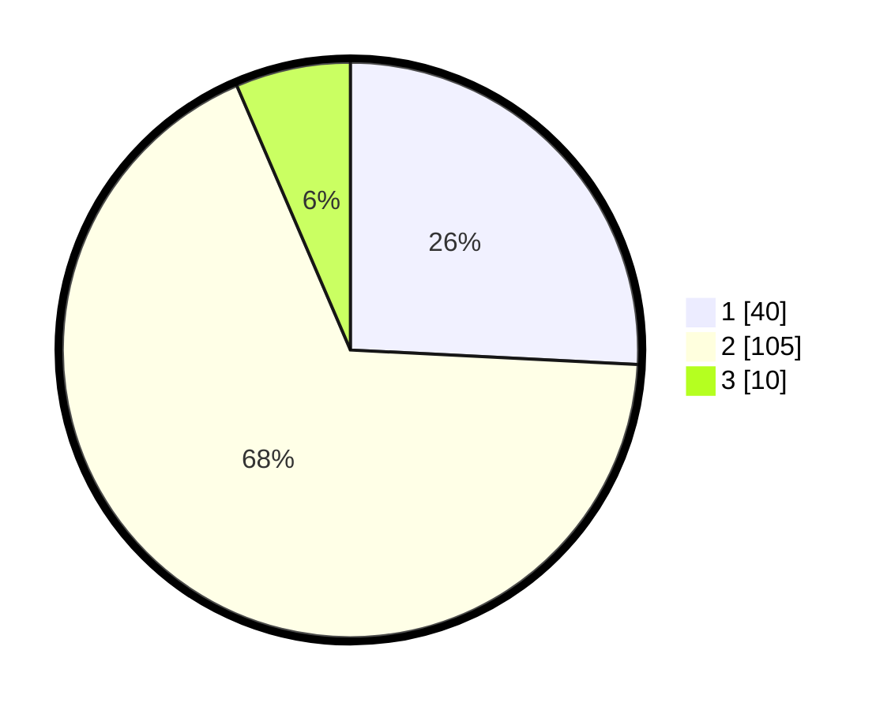

# Hasil

## Grafik

## Tabel

| No. | Nama Paslon    | Suara | Suara (raw) | Persentase |
|:--- |:-------------- | -----:| -----------:| ----------:|
| 1   | ANIES MUHAIMIN | 40    | [40][p-1]   | 25,81      |
| 2   | PRABOWO GIBRAN | 105   | [105][p-2]  | 67,74      |
| 3   | GANJAR MAHFUD  | 10    | [10][p-3]   | 6,45       |

[p-1]: https://github.com/gigit-pemilu/pemilu-2024-73-sulawesi-selatan/blob/main/pilpres/hitung-suara/sub/73-sulawesi-selatan/sub/71-kota-makassar/sub/10-tamalate/sub/1001-barombong/sub/001-tps/sub/paslon-1.txt
[p-2]: https://github.com/gigit-pemilu/pemilu-2024-73-sulawesi-selatan/blob/main/pilpres/hitung-suara/sub/73-sulawesi-selatan/sub/71-kota-makassar/sub/10-tamalate/sub/1001-barombong/sub/001-tps/sub/paslon-2.txt
[p-3]: https://github.com/gigit-pemilu/pemilu-2024-73-sulawesi-selatan/blob/main/pilpres/hitung-suara/sub/73-sulawesi-selatan/sub/71-kota-makassar/sub/10-tamalate/sub/1001-barombong/sub/001-tps/sub/paslon-3.txt

## Foto C Plano

https://sirekap-obj-formc.kpu.go.id/b1f1/pemilu/ppwp/73/71/10/10/01/7371101001001-20240215-030101--6829b191-542f-4873-93de-45a63e210874.jpg

https://sirekap-obj-formc.kpu.go.id/b1f1/pemilu/ppwp/73/71/10/10/01/7371101001001-20240215-030314--170d37bc-bfb6-46d6-a9b9-0cb740572d33.jpg

https://sirekap-obj-formc.kpu.go.id/b1f1/pemilu/ppwp/73/71/10/10/01/7371101001001-20240215-030953--6f84b36c-c2b1-492a-aa8e-905d6ada3460.jpg

## Metadata

| Key        | Value               |
| ---------- | ------------------- |
| Time Stamp | 2024-02-15 17:30:25 |

