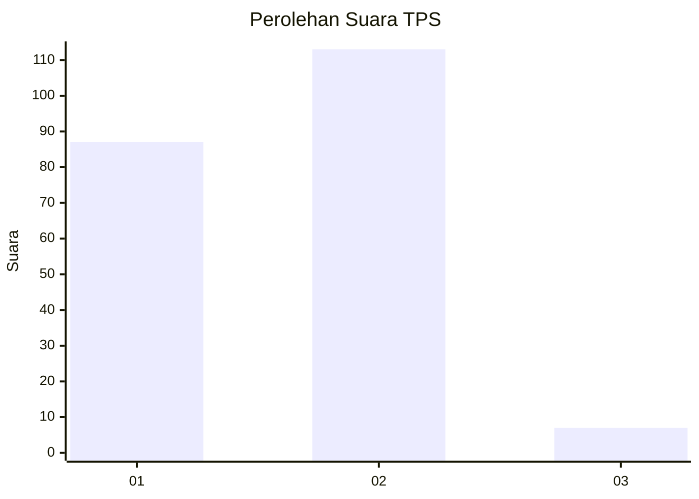
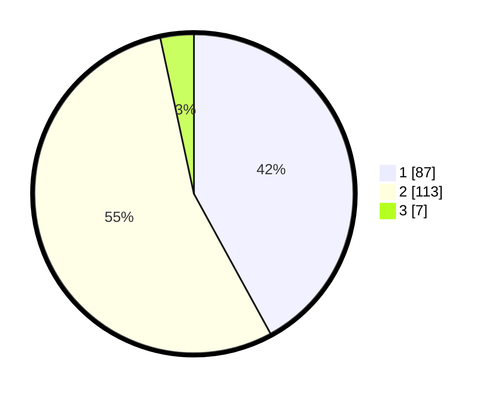

# Hasil

## Grafik

## Tabel

| No. | Nama Paslon    | Suara | Suara (raw) | Persentase |
|:--- |:-------------- | -----:| -----------:| ----------:|
| 1   | ANIES MUHAIMIN | 87    | [87][p-1]   | 42,03      |
| 2   | PRABOWO GIBRAN | 113   | [113][p-2]  | 54,59      |
| 3   | GANJAR MAHFUD  | 7     | [7][p-3]    | 3,38       |

[p-1]: https://github.com/gigit-pemilu/pemilu-2024-73-sulawesi-selatan/blob/main/pilpres/hitung-suara/sub/73-sulawesi-selatan/sub/71-kota-makassar/sub/10-tamalate/sub/1001-barombong/sub/004-tps/sub/paslon-1.txt
[p-2]: https://github.com/gigit-pemilu/pemilu-2024-73-sulawesi-selatan/blob/main/pilpres/hitung-suara/sub/73-sulawesi-selatan/sub/71-kota-makassar/sub/10-tamalate/sub/1001-barombong/sub/004-tps/sub/paslon-2.txt
[p-3]: https://github.com/gigit-pemilu/pemilu-2024-73-sulawesi-selatan/blob/main/pilpres/hitung-suara/sub/73-sulawesi-selatan/sub/71-kota-makassar/sub/10-tamalate/sub/1001-barombong/sub/004-tps/sub/paslon-3.txt

## Foto C Plano

https://sirekap-obj-formc.kpu.go.id/8605/pemilu/ppwp/73/71/10/10/01/7371101001004-20240215-061400--ffaf6fd0-88d9-46c0-bb4b-16c47dcea957.jpg

https://sirekap-obj-formc.kpu.go.id/8605/pemilu/ppwp/73/71/10/10/01/7371101001004-20240214-155241--c8c3fb19-2c0d-4a41-ba3e-71ce92a5e333.jpg

https://sirekap-obj-formc.kpu.go.id/8605/pemilu/ppwp/73/71/10/10/01/7371101001004-20240215-060922--e4afc772-22e1-4eaa-a5a9-8b9d374f43f9.jpg

## Metadata

| Key        | Value               |
| ---------- | ------------------- |
| Time Stamp | 2024-02-15 17:30:25 |

