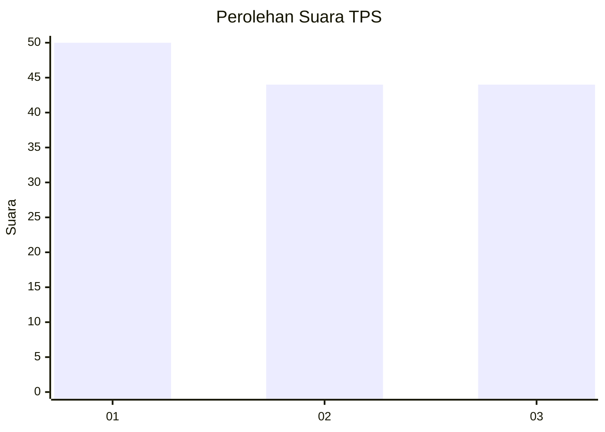
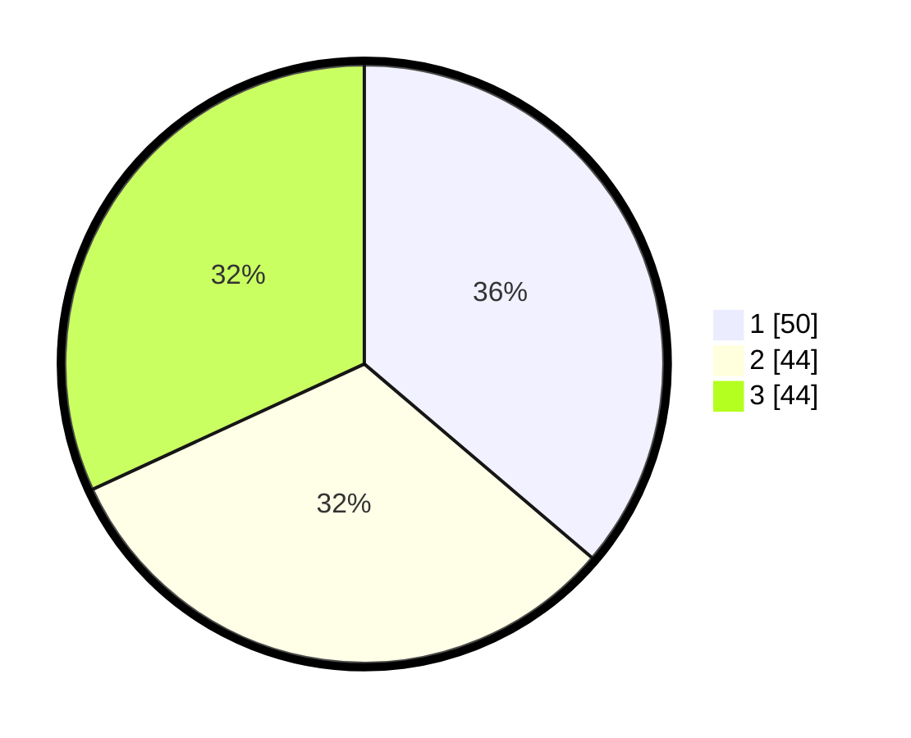

# Hasil

## Grafik

## Tabel

| No. | Nama Paslon    | Suara | Suara (raw) | Persentase |
|:--- |:-------------- | -----:| -----------:| ----------:|
| 1   | ANIES MUHAIMIN | 50    | [50][p-1]   | 36,23      |
| 2   | PRABOWO GIBRAN | 44    | [44][p-2]   | 31,88      |
| 3   | GANJAR MAHFUD  | 44    | [44][p-3]   | 31,88      |

[p-1]: https://github.com/gigit-pemilu/pemilu-2024-73-sulawesi-selatan/blob/main/pilpres/hitung-suara/sub/73-sulawesi-selatan/sub/71-kota-makassar/sub/10-tamalate/sub/1008-pa'baeng-baeng/sub/015-tps/sub/paslon-1.txt
[p-2]: https://github.com/gigit-pemilu/pemilu-2024-73-sulawesi-selatan/blob/main/pilpres/hitung-suara/sub/73-sulawesi-selatan/sub/71-kota-makassar/sub/10-tamalate/sub/1008-pa'baeng-baeng/sub/015-tps/sub/paslon-2.txt
[p-3]: https://github.com/gigit-pemilu/pemilu-2024-73-sulawesi-selatan/blob/main/pilpres/hitung-suara/sub/73-sulawesi-selatan/sub/71-kota-makassar/sub/10-tamalate/sub/1008-pa'baeng-baeng/sub/015-tps/sub/paslon-3.txt

## Foto C Plano

https://sirekap-obj-formc.kpu.go.id/d1c0/pemilu/ppwp/73/71/10/10/08/7371101008015-20240214-202628--9a9bfc6c-2a59-4a57-a6c0-e69e57f909fb.jpg

https://sirekap-obj-formc.kpu.go.id/d1c0/pemilu/ppwp/73/71/10/10/08/7371101008015-20240214-203019--e5737476-e7e1-43af-a5ff-eff4a2f1ea2d.jpg

https://sirekap-obj-formc.kpu.go.id/d1c0/pemilu/ppwp/73/71/10/10/08/7371101008015-20240214-213203--6e26dfdb-d960-40e2-a0ec-bec3d0c526f1.jpg

## Metadata

| Key        | Value               |
| ---------- | ------------------- |
| Time Stamp | 2024-02-15 00:41:44 |

