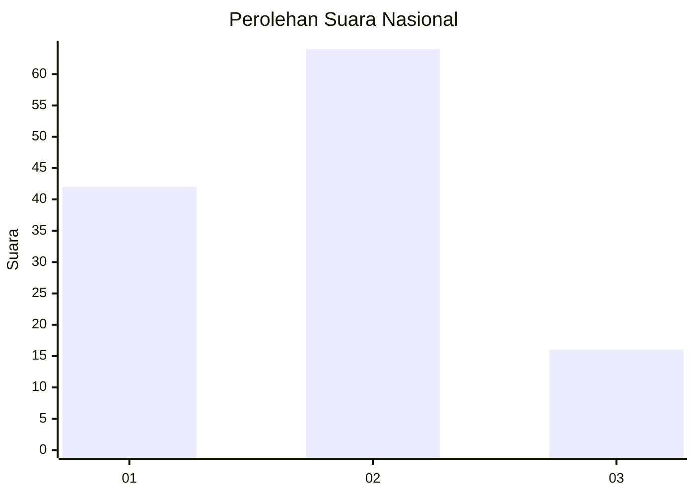
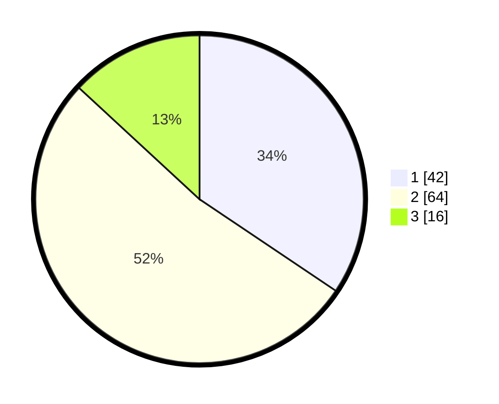

# Hasil

## Grafik

## Tabel

| No. | Nama Paslon    | Suara | Suara (raw) | Persentase |
|:--- |:-------------- | -----:| -----------:| ----------:|
| 1   | ANIES MUHAIMIN | 42    | [42][p-1]   | 34,43      |
| 2   | PRABOWO GIBRAN | 64    | [64][p-2]   | 52,46      |
| 3   | GANJAR MAHFUD  | 16    | [16][p-3]   | 13,11      |

[p-1]: https://github.com/gigit-pemilu/pemilu-2024/blob/main/pilpres/hitung-suara/sub/73-sulawesi-selatan/sub/71-kota-makassar/sub/10-tamalate/sub/1010-tanjung-merdeka/sub/004-tps/sub/paslon-1.txt
[p-2]: https://github.com/gigit-pemilu/pemilu-2024/blob/main/pilpres/hitung-suara/sub/73-sulawesi-selatan/sub/71-kota-makassar/sub/10-tamalate/sub/1010-tanjung-merdeka/sub/004-tps/sub/paslon-2.txt
[p-3]: https://github.com/gigit-pemilu/pemilu-2024/blob/main/pilpres/hitung-suara/sub/73-sulawesi-selatan/sub/71-kota-makassar/sub/10-tamalate/sub/1010-tanjung-merdeka/sub/004-tps/sub/paslon-3.txt

## Foto C Plano

https://sirekap-obj-formc.kpu.go.id/dd27/pemilu/ppwp/73/71/10/10/10/7371101010004-20240214-200716--c91b42f2-8c14-4c22-81ab-df464a4138d3.jpg

https://sirekap-obj-formc.kpu.go.id/dd27/pemilu/ppwp/73/71/10/10/10/7371101010004-20240214-200235--df643797-65a6-4702-b064-b83696ada930.jpg

https://sirekap-obj-formc.kpu.go.id/dd27/pemilu/ppwp/73/71/10/10/10/7371101010004-20240214-200254--0e08c9ed-1498-442a-a557-9cd2d67c2bab.jpg

## Metadata

| Key        | Value               |
| ---------- | ------------------- |
| Time Stamp | 2024-02-15 15:00:29 |

