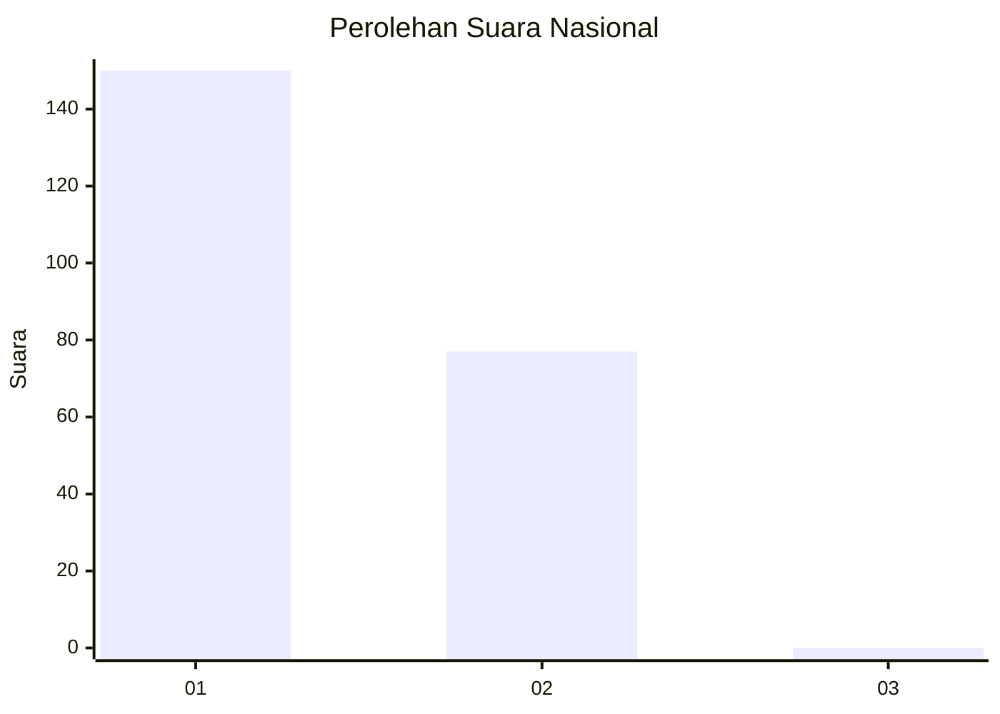
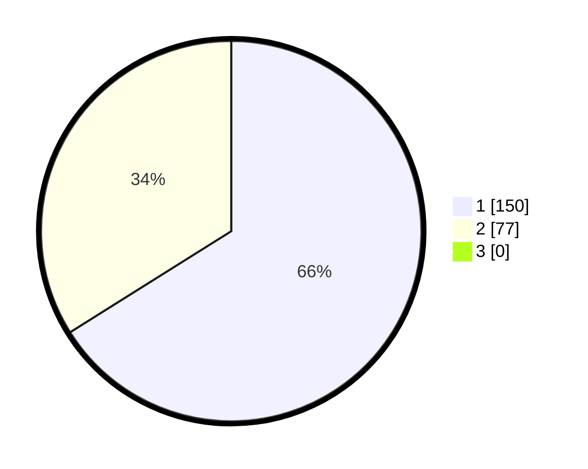

# Hasil

## Grafik

## Tabel

| No. | Nama Paslon    | Suara | Suara (raw) | Persentase |
|:--- |:-------------- | -----:| -----------:| ----------:|
| 1   | ANIES MUHAIMIN | 150   | [150][p-1]  | 66,08      |
| 2   | PRABOWO GIBRAN | 77    | [77][p-2]   | 33,92      |
| 3   | GANJAR MAHFUD  | 0     | [0][p-3]    | 0,00       |

[p-1]: https://github.com/gigit-pemilu/pemilu-2024/blob/main/pilpres/hitung-suara/sub/73-sulawesi-selatan/sub/71-kota-makassar/sub/12-manggala/sub/1001-manggala/sub/008-tps/sub/paslon-1.txt
[p-2]: https://github.com/gigit-pemilu/pemilu-2024/blob/main/pilpres/hitung-suara/sub/73-sulawesi-selatan/sub/71-kota-makassar/sub/12-manggala/sub/1001-manggala/sub/008-tps/sub/paslon-2.txt
[p-3]: https://github.com/gigit-pemilu/pemilu-2024/blob/main/pilpres/hitung-suara/sub/73-sulawesi-selatan/sub/71-kota-makassar/sub/12-manggala/sub/1001-manggala/sub/008-tps/sub/paslon-3.txt

## Foto C Plano

https://sirekap-obj-formc.kpu.go.id/e4dd/pemilu/ppwp/73/71/12/10/01/7371121001008-20240214-203517--b8a917e1-3e97-4600-a307-ef4c037cdc16.jpg

https://sirekap-obj-formc.kpu.go.id/e4dd/pemilu/ppwp/73/71/12/10/01/7371121001008-20240214-203357--af94ab25-2f50-4cb1-86ff-a71e2a7bf663.jpg

https://sirekap-obj-formc.kpu.go.id/e4dd/pemilu/ppwp/73/71/12/10/01/7371121001008-20240214-203626--f0e23742-2404-4291-b718-563d24e82114.jpg

## Metadata

| Key        | Value               |
| ---------- | ------------------- |
| Time Stamp | 2024-02-15 00:41:44 |

