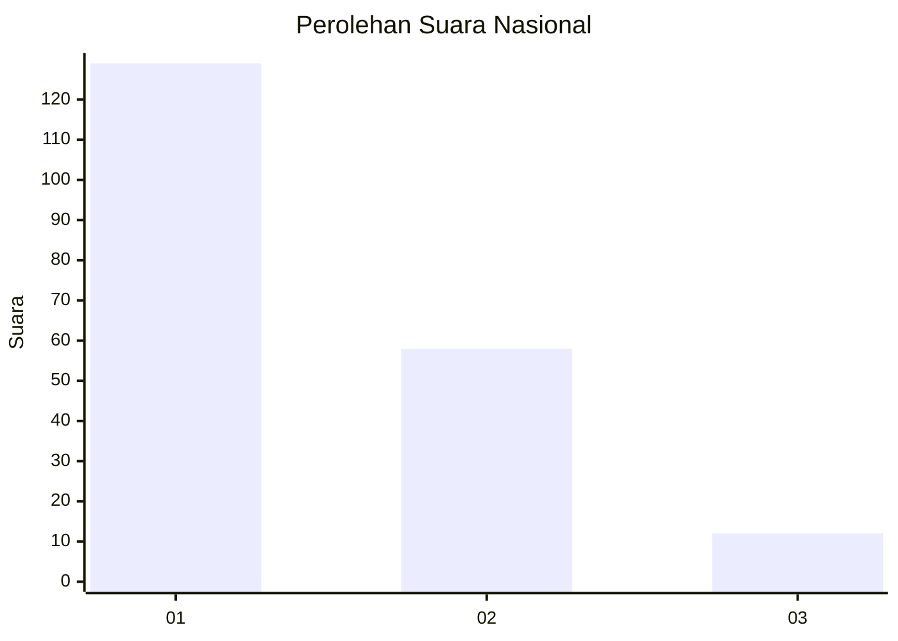
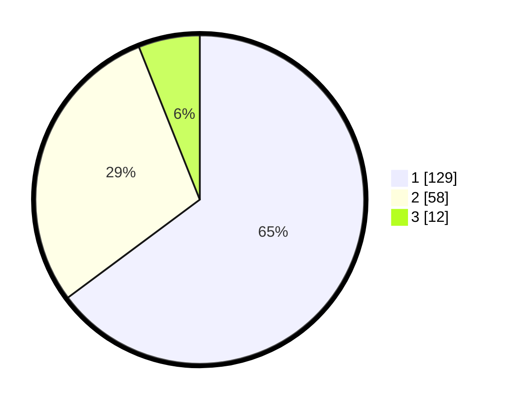

# Hasil

## Grafik

## Tabel

| No. | Nama Paslon    | Suara | Suara (raw) | Persentase |
|:--- |:-------------- | -----:| -----------:| ----------:|
| 1   | ANIES MUHAIMIN | 129   | [129][p-1]  | 64,82      |
| 2   | PRABOWO GIBRAN | 58    | [58][p-2]   | 29,15      |
| 3   | GANJAR MAHFUD  | 12    | [12][p-3]   | 6,03       |

[p-1]: https://github.com/gigit-pemilu/pemilu-2024/blob/main/pilpres/hitung-suara/sub/73-sulawesi-selatan/sub/71-kota-makassar/sub/12-manggala/sub/1001-manggala/sub/060-tps/sub/paslon-1.txt
[p-2]: https://github.com/gigit-pemilu/pemilu-2024/blob/main/pilpres/hitung-suara/sub/73-sulawesi-selatan/sub/71-kota-makassar/sub/12-manggala/sub/1001-manggala/sub/060-tps/sub/paslon-2.txt
[p-3]: https://github.com/gigit-pemilu/pemilu-2024/blob/main/pilpres/hitung-suara/sub/73-sulawesi-selatan/sub/71-kota-makassar/sub/12-manggala/sub/1001-manggala/sub/060-tps/sub/paslon-3.txt

## Foto C Plano

https://sirekap-obj-formc.kpu.go.id/884c/pemilu/ppwp/73/71/12/10/01/7371121001060-20240215-152819--010369a7-f1ac-4b3a-8f39-69f6571fd9d6.jpg

https://sirekap-obj-formc.kpu.go.id/884c/pemilu/ppwp/73/71/12/10/01/7371121001060-20240215-152936--2c399c8c-0fb6-4f99-884a-685d6ee6aafa.jpg

https://sirekap-obj-formc.kpu.go.id/884c/pemilu/ppwp/73/71/12/10/01/7371121001060-20240215-153059--8cf5075e-dea0-4500-b574-099c04e78939.jpg

## Metadata

| Key        | Value               |
| ---------- | ------------------- |
| Time Stamp | 2024-02-15 17:00:25 |

