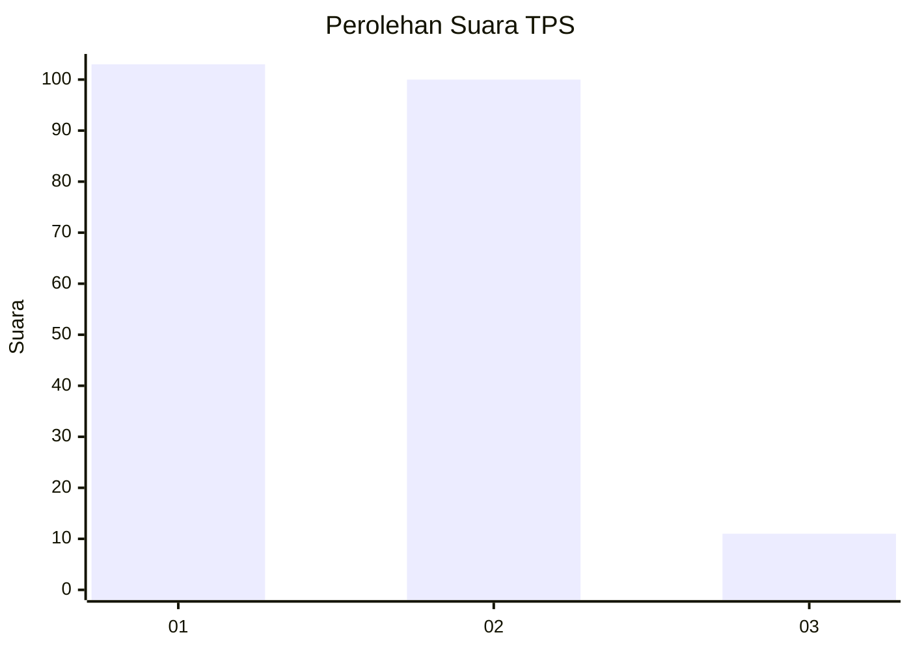
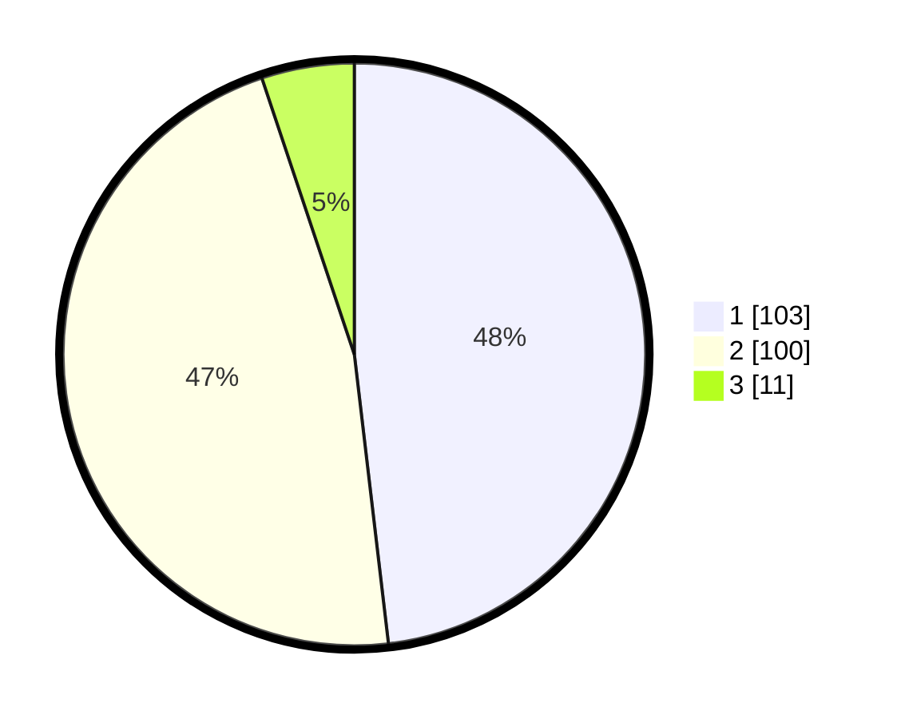

# Hasil

## Grafik

## Tabel

| No. | Nama Paslon    | Suara | Suara (raw) | Persentase |
|:--- |:-------------- | -----:| -----------:| ----------:|
| 1   | ANIES MUHAIMIN | 103   | [103][p-1]  | 48,13      |
| 2   | PRABOWO GIBRAN | 100   | [100][p-2]  | 46,73      |
| 3   | GANJAR MAHFUD  | 11    | [11][p-3]   | 5,14       |

[p-1]: https://github.com/gigit-pemilu/pemilu-2024-73-sulawesi-selatan/blob/main/pilpres/hitung-suara/sub/73-sulawesi-selatan/sub/71-kota-makassar/sub/13-rappocini/sub/1001-tidung/sub/003-tps/sub/paslon-1.txt
[p-2]: https://github.com/gigit-pemilu/pemilu-2024-73-sulawesi-selatan/blob/main/pilpres/hitung-suara/sub/73-sulawesi-selatan/sub/71-kota-makassar/sub/13-rappocini/sub/1001-tidung/sub/003-tps/sub/paslon-2.txt
[p-3]: https://github.com/gigit-pemilu/pemilu-2024-73-sulawesi-selatan/blob/main/pilpres/hitung-suara/sub/73-sulawesi-selatan/sub/71-kota-makassar/sub/13-rappocini/sub/1001-tidung/sub/003-tps/sub/paslon-3.txt

## Foto C Plano

https://sirekap-obj-formc.kpu.go.id/9e90/pemilu/ppwp/73/71/13/10/01/7371131001003-20240215-002611--3c685897-a166-4ea6-8537-3d42f1cf0dc1.jpg

https://sirekap-obj-formc.kpu.go.id/9e90/pemilu/ppwp/73/71/13/10/01/7371131001003-20240215-002834--2f03f392-70c3-42ac-be06-eab7dc17aef5.jpg

https://sirekap-obj-formc.kpu.go.id/9e90/pemilu/ppwp/73/71/13/10/01/7371131001003-20240215-002927--28f77ba0-35b5-4656-b868-1de0ae4495ac.jpg

## Metadata

| Key        | Value               |
| ---------- | ------------------- |
| Time Stamp | 2024-02-15 15:00:29 |

