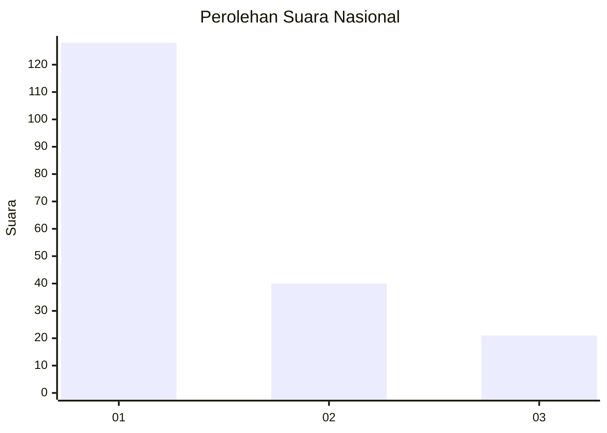
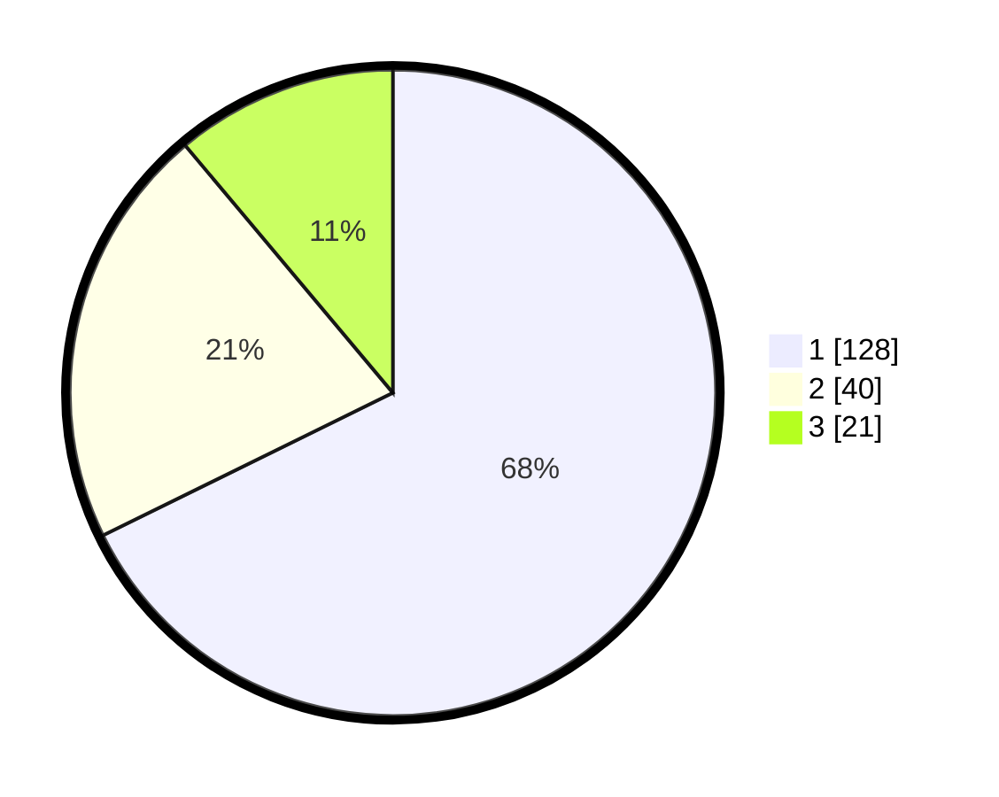

# Hasil

## Grafik

## Tabel

| No. | Nama Paslon    | Suara | Suara (raw) | Persentase |
|:--- |:-------------- | -----:| -----------:| ----------:|
| 1   | ANIES MUHAIMIN | 128   | [128][p-1]  | 67,72      |
| 2   | PRABOWO GIBRAN | 40    | [40][p-2]   | 21,16      |
| 3   | GANJAR MAHFUD  | 21    | [21][p-3]   | 11,11      |

[p-1]: https://github.com/gigit-pemilu/pemilu-2024/blob/main/pilpres/hitung-suara/sub/73-sulawesi-selatan/sub/71-kota-makassar/sub/13-rappocini/sub/1001-tidung/sub/023-tps/sub/paslon-1.txt
[p-2]: https://github.com/gigit-pemilu/pemilu-2024/blob/main/pilpres/hitung-suara/sub/73-sulawesi-selatan/sub/71-kota-makassar/sub/13-rappocini/sub/1001-tidung/sub/023-tps/sub/paslon-2.txt
[p-3]: https://github.com/gigit-pemilu/pemilu-2024/blob/main/pilpres/hitung-suara/sub/73-sulawesi-selatan/sub/71-kota-makassar/sub/13-rappocini/sub/1001-tidung/sub/023-tps/sub/paslon-3.txt

## Foto C Plano

https://sirekap-obj-formc.kpu.go.id/8d1a/pemilu/ppwp/73/71/13/10/01/7371131001023-20240215-003501--cfc37f26-20b5-4652-9efa-80b41c00339e.jpg

https://sirekap-obj-formc.kpu.go.id/8d1a/pemilu/ppwp/73/71/13/10/01/7371131001023-20240215-003630--9a671dc3-25ce-4c74-b940-2f043334486e.jpg

https://sirekap-obj-formc.kpu.go.id/8d1a/pemilu/ppwp/73/71/13/10/01/7371131001023-20240215-003718--e292c58e-ad1c-4bc5-84da-3db7b202cd3c.jpg

## Metadata

| Key        | Value               |
| ---------- | ------------------- |
| Time Stamp | 2024-02-15 16:00:26 |

