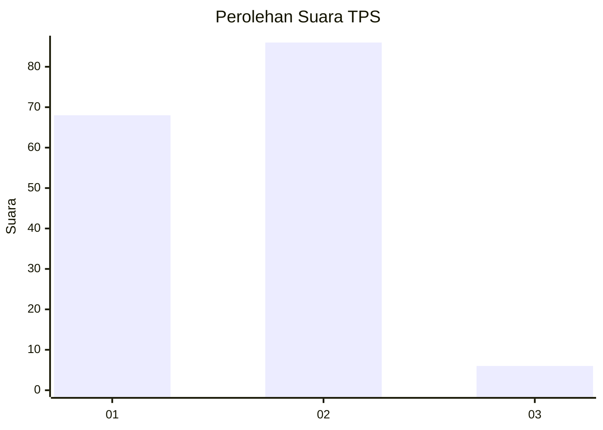
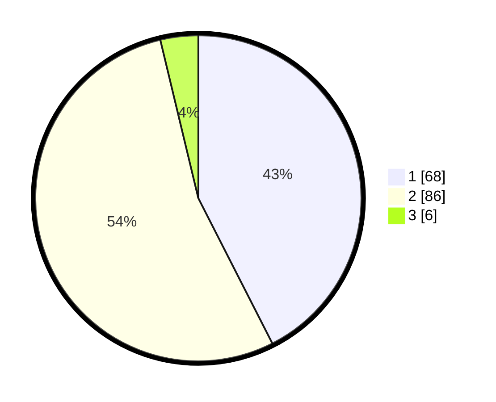

# Hasil

## Grafik

## Tabel

| No. | Nama Paslon    | Suara | Suara (raw) | Persentase |
|:--- |:-------------- | -----:| -----------:| ----------:|
| 1   | ANIES MUHAIMIN | 68    | [68][p-1]   | 42,50      |
| 2   | PRABOWO GIBRAN | 86    | [86][p-2]   | 53,75      |
| 3   | GANJAR MAHFUD  | 6     | [6][p-3]    | 3,75       |

[p-1]: https://github.com/gigit-pemilu/pemilu-2024-73-sulawesi-selatan/blob/main/pilpres/hitung-suara/sub/73-sulawesi-selatan/sub/71-kota-makassar/sub/13-rappocini/sub/1006-rappocini/sub/002-tps/sub/paslon-1.txt
[p-2]: https://github.com/gigit-pemilu/pemilu-2024-73-sulawesi-selatan/blob/main/pilpres/hitung-suara/sub/73-sulawesi-selatan/sub/71-kota-makassar/sub/13-rappocini/sub/1006-rappocini/sub/002-tps/sub/paslon-2.txt
[p-3]: https://github.com/gigit-pemilu/pemilu-2024-73-sulawesi-selatan/blob/main/pilpres/hitung-suara/sub/73-sulawesi-selatan/sub/71-kota-makassar/sub/13-rappocini/sub/1006-rappocini/sub/002-tps/sub/paslon-3.txt

## Foto C Plano

https://sirekap-obj-formc.kpu.go.id/d352/pemilu/ppwp/73/71/13/10/06/7371131006002-20240218-192457--352964ee-309f-4541-94af-d4f3dafb0907.jpg

https://sirekap-obj-formc.kpu.go.id/d352/pemilu/ppwp/73/71/13/10/06/7371131006002-20240218-192616--c2dfdacb-85a2-4c53-9a80-b7d66aa1735b.jpg

https://sirekap-obj-formc.kpu.go.id/d352/pemilu/ppwp/73/71/13/10/06/7371131006002-20240218-192748--393dd897-8f3b-44a6-87c8-0d0bbcc33c85.jpg

## Metadata

| Key        | Value               |
| ---------- | ------------------- |
| Time Stamp | 2024-02-19 06:16:00 |

## DATA PEMILIH TETAP

Jumlah pemilih dalam DPT: **201**.
 * L: **222**.
 * P: **0**.

## DATA PENGGUNA HAK PILIH

Jumlah pengguna hak pilih dalam DPT: **1**.
 * L: **22**.
 * P: **22**.

Jumlah pengguna hak pilih dalam DPTb: **222**.
 * L: **401**.
 * P: **542**.

Jumlah pengguna hak pilih dalam DPK: **202**.
 * L: **222**.
 * P: **225**.

Jumlah pengguna hak pilih: **230**.
 * L: **225**.
 * P: **253**.

## JUMLAH SUARA SAH DAN TIDAK SAH

JUMLAH SELURUH SUARA SAH: **160**.

JUMLAH SUARA TIDAK SAH: **3**.

JUMLAH SELURUH SUARA SAH DAN SUARA TIDAK SAH: **163**.

