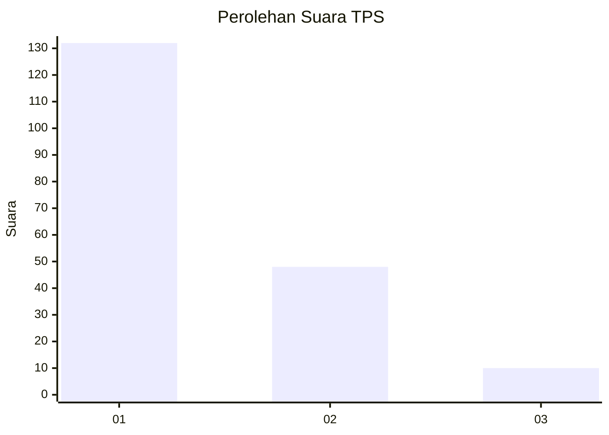
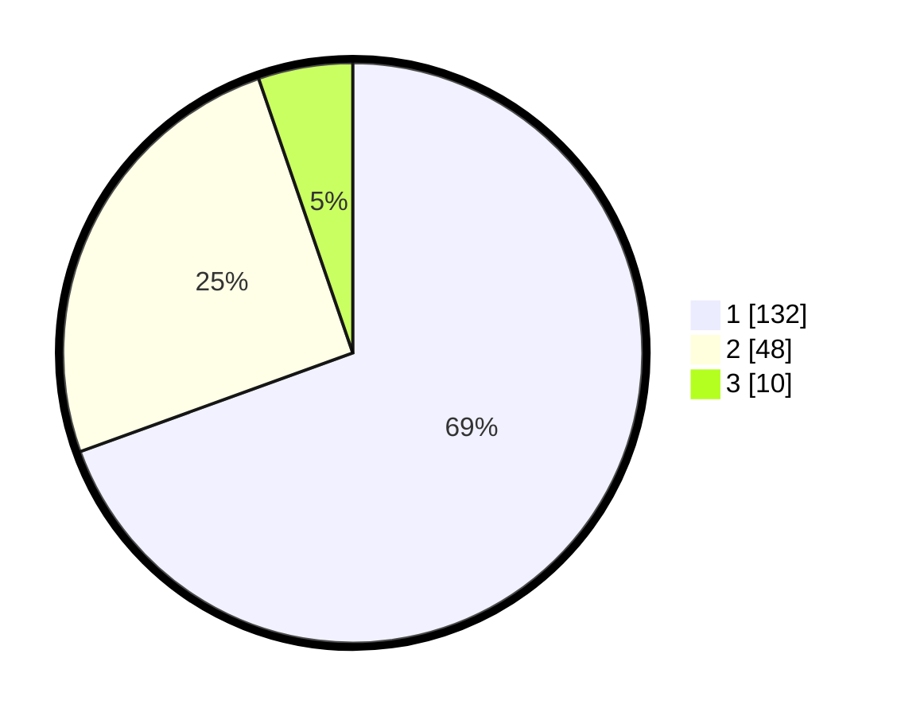

# Hasil

## Grafik

## Tabel

| No. | Nama Paslon    | Suara | Suara (raw) | Persentase |
|:--- |:-------------- | -----:| -----------:| ----------:|
| 1   | ANIES MUHAIMIN | 132   | [132][p-1]  | 69,47      |
| 2   | PRABOWO GIBRAN | 48    | [48][p-2]   | 25,26      |
| 3   | GANJAR MAHFUD  | 10    | [10][p-3]   | 5,26       |

[p-1]: https://github.com/gigit-pemilu/pemilu-2024-73-sulawesi-selatan/blob/main/pilpres/hitung-suara/sub/73-sulawesi-selatan/sub/71-kota-makassar/sub/13-rappocini/sub/1010-gunung-sari/sub/006-tps/sub/paslon-1.txt
[p-2]: https://github.com/gigit-pemilu/pemilu-2024-73-sulawesi-selatan/blob/main/pilpres/hitung-suara/sub/73-sulawesi-selatan/sub/71-kota-makassar/sub/13-rappocini/sub/1010-gunung-sari/sub/006-tps/sub/paslon-2.txt
[p-3]: https://github.com/gigit-pemilu/pemilu-2024-73-sulawesi-selatan/blob/main/pilpres/hitung-suara/sub/73-sulawesi-selatan/sub/71-kota-makassar/sub/13-rappocini/sub/1010-gunung-sari/sub/006-tps/sub/paslon-3.txt

## Foto C Plano

https://sirekap-obj-formc.kpu.go.id/f43c/pemilu/ppwp/73/71/13/10/10/7371131010006-20240214-205919--eb0d3481-f8ce-47e6-bf9f-8281a75496c4.jpg

https://sirekap-obj-formc.kpu.go.id/f43c/pemilu/ppwp/73/71/13/10/10/7371131010006-20240214-210155--82876143-ef94-4a92-9027-ba5ed7e96e93.jpg

https://sirekap-obj-formc.kpu.go.id/f43c/pemilu/ppwp/73/71/13/10/10/7371131010006-20240214-210313--c617306f-66fa-47d5-9835-fefe71df31ad.jpg

## Metadata

| Key        | Value               |
| ---------- | ------------------- |
| Time Stamp | 2024-02-15 15:00:29 |

