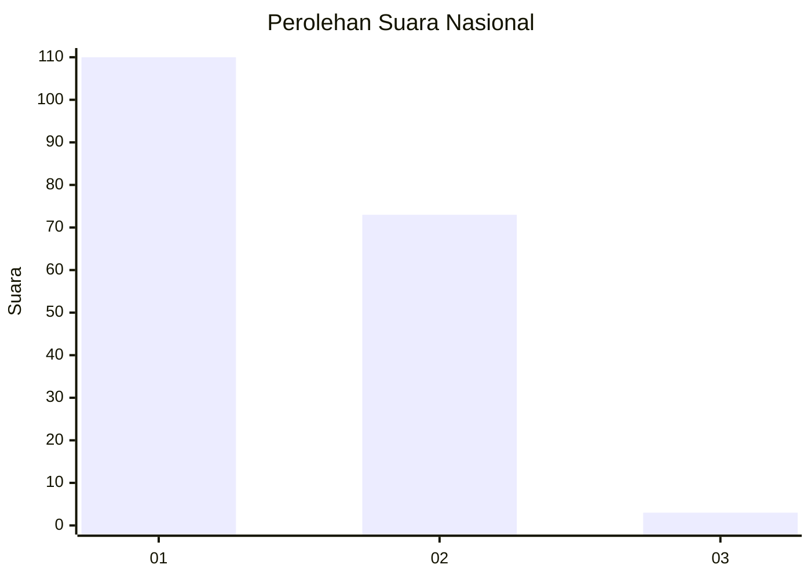
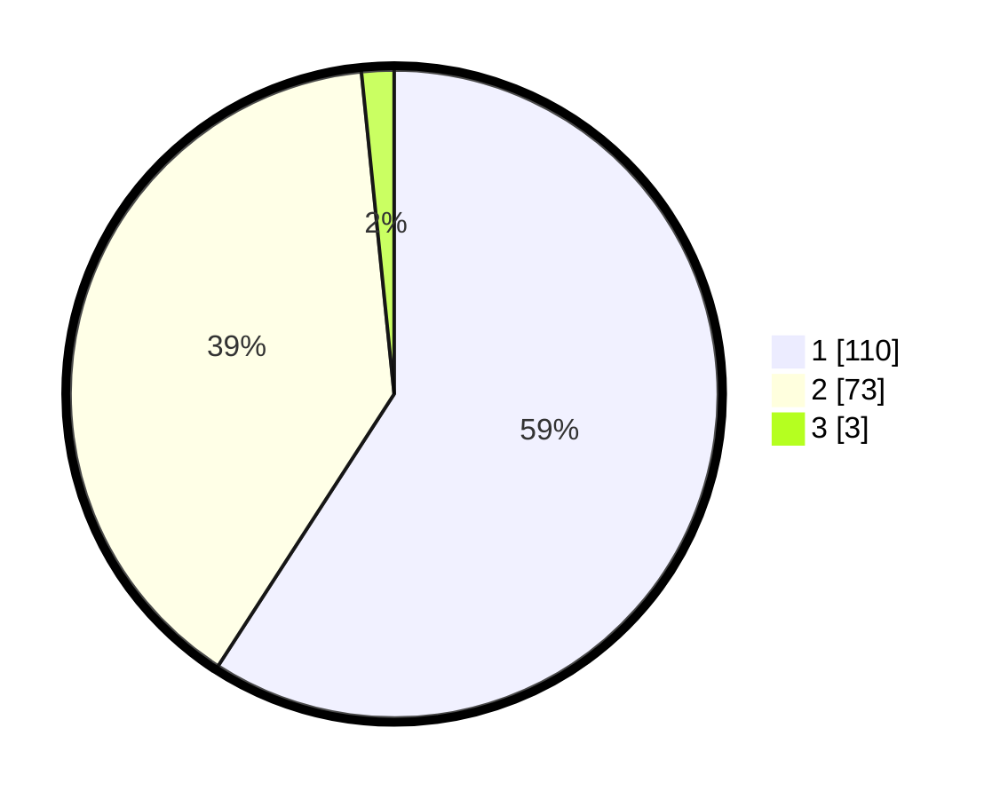

# Hasil

## Grafik

## Tabel

| No. | Nama Paslon    | Suara | Suara (raw) | Persentase |
|:--- |:-------------- | -----:| -----------:| ----------:|
| 1   | ANIES MUHAIMIN | 110   | [110][p-1]  | 59,14      |
| 2   | PRABOWO GIBRAN | 73    | [73][p-2]   | 39,25      |
| 3   | GANJAR MAHFUD  | 3     | [3][p-3]    | 1,61       |

[p-1]: https://github.com/gigit-pemilu/pemilu-2024/blob/main/pilpres/hitung-suara/sub/73-sulawesi-selatan/sub/71-kota-makassar/sub/14-tamalanrea/sub/1001-tamalanrea/sub/003-tps/sub/paslon-1.txt
[p-2]: https://github.com/gigit-pemilu/pemilu-2024/blob/main/pilpres/hitung-suara/sub/73-sulawesi-selatan/sub/71-kota-makassar/sub/14-tamalanrea/sub/1001-tamalanrea/sub/003-tps/sub/paslon-2.txt
[p-3]: https://github.com/gigit-pemilu/pemilu-2024/blob/main/pilpres/hitung-suara/sub/73-sulawesi-selatan/sub/71-kota-makassar/sub/14-tamalanrea/sub/1001-tamalanrea/sub/003-tps/sub/paslon-3.txt

## Foto C Plano

https://sirekap-obj-formc.kpu.go.id/f970/pemilu/ppwp/73/71/14/10/01/7371141001003-20240218-161701--e3c9a9df-1f51-4d7a-b0ad-a1bb81433c70.jpg

https://sirekap-obj-formc.kpu.go.id/f970/pemilu/ppwp/73/71/14/10/01/7371141001003-20240218-161810--c82c8e4b-3819-40ae-96ce-bb3e7317ee85.jpg

https://sirekap-obj-formc.kpu.go.id/f970/pemilu/ppwp/73/71/14/10/01/7371141001003-20240218-161926--127e94c7-0e72-4806-bd2d-488d8dd0eaba.jpg

## Metadata

| Key        | Value               |
| ---------- | ------------------- |
| Time Stamp | 2024-02-19 17:00:00 |

