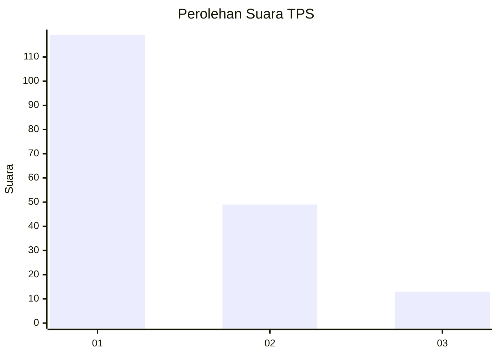
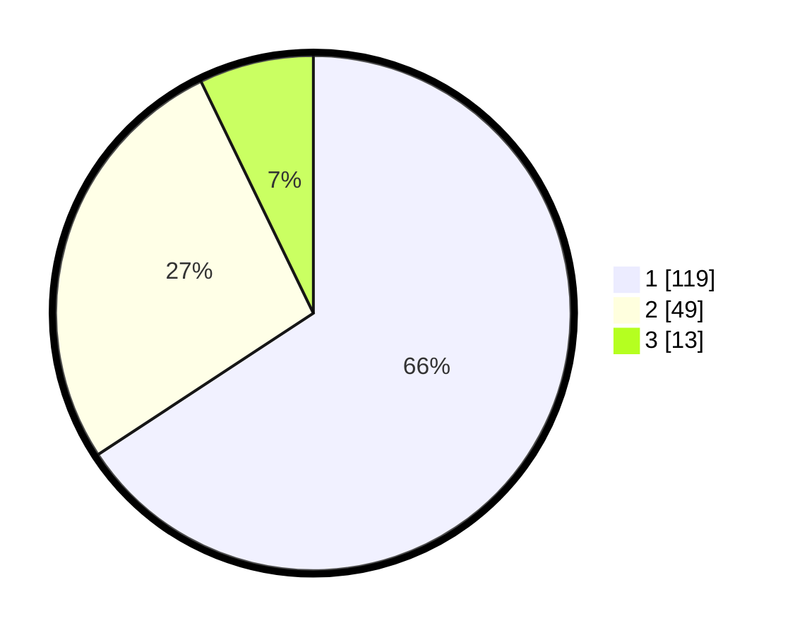

# Hasil

## Grafik

## Tabel

| No. | Nama Paslon    | Suara | Suara (raw) | Persentase |
|:--- |:-------------- | -----:| -----------:| ----------:|
| 1   | ANIES MUHAIMIN | 119   | [119][p-1]  | 65,75      |
| 2   | PRABOWO GIBRAN | 49    | [49][p-2]   | 27,07      |
| 3   | GANJAR MAHFUD  | 13    | [13][p-3]   | 7,18       |

[p-1]: https://github.com/gigit-pemilu/pemilu-2024-73-sulawesi-selatan/blob/main/pilpres/hitung-suara/sub/73-sulawesi-selatan/sub/71-kota-makassar/sub/14-tamalanrea/sub/1007-buntusu/sub/037-tps/sub/paslon-1.txt
[p-2]: https://github.com/gigit-pemilu/pemilu-2024-73-sulawesi-selatan/blob/main/pilpres/hitung-suara/sub/73-sulawesi-selatan/sub/71-kota-makassar/sub/14-tamalanrea/sub/1007-buntusu/sub/037-tps/sub/paslon-2.txt
[p-3]: https://github.com/gigit-pemilu/pemilu-2024-73-sulawesi-selatan/blob/main/pilpres/hitung-suara/sub/73-sulawesi-selatan/sub/71-kota-makassar/sub/14-tamalanrea/sub/1007-buntusu/sub/037-tps/sub/paslon-3.txt

## Foto C Plano

https://sirekap-obj-formc.kpu.go.id/2d30/pemilu/ppwp/73/71/14/10/07/7371141007037-20240214-222245--968cd2a7-3a30-4eb2-84d2-95c2e0a826b4.jpg

https://sirekap-obj-formc.kpu.go.id/2d30/pemilu/ppwp/73/71/14/10/07/7371141007037-20240214-222726--945e9442-bd5e-4ab4-829e-1abca823efa0.jpg

https://sirekap-obj-formc.kpu.go.id/2d30/pemilu/ppwp/73/71/14/10/07/7371141007037-20240214-222535--1a82d371-8a64-4fb1-bf14-f4026a2eab71.jpg

## Metadata

| Key        | Value               |
| ---------- | ------------------- |
| Time Stamp | 2024-02-15 22:40:13 |

