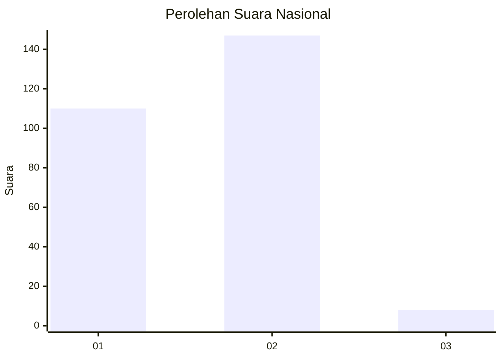
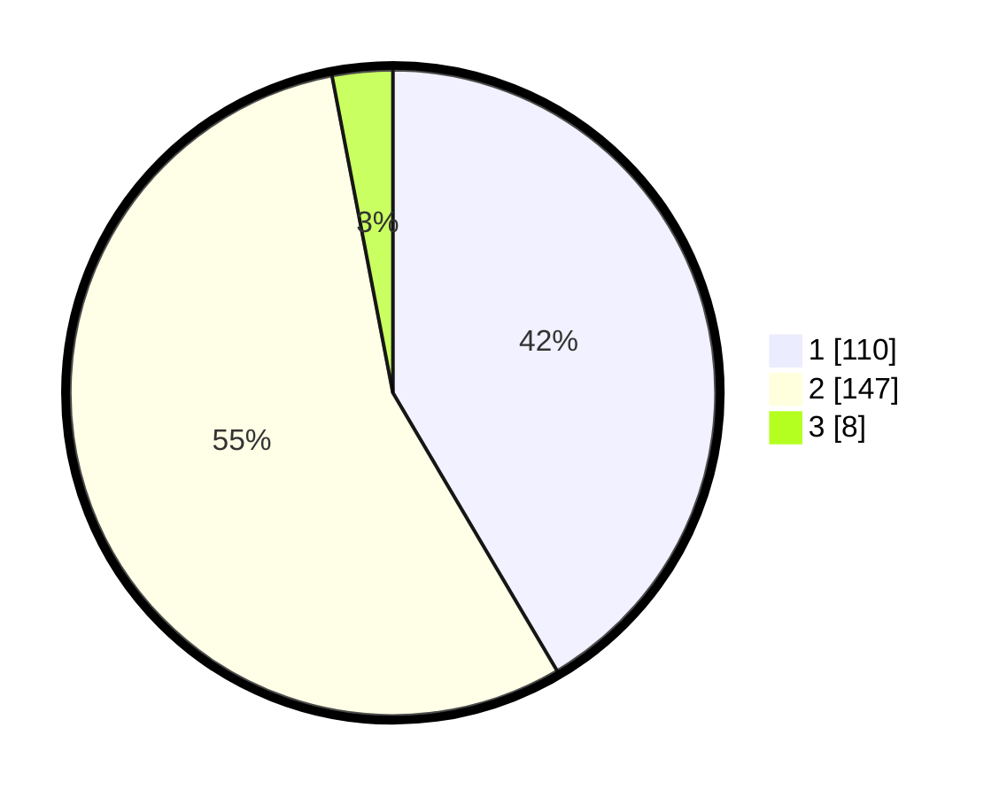

# Hasil

## Grafik

## Tabel

| No. | Nama Paslon    | Suara | Suara (raw) | Persentase |
|:--- |:-------------- | -----:| -----------:| ----------:|
| 1   | ANIES MUHAIMIN | 110   | [110][p-1]  | 41,51      |
| 2   | PRABOWO GIBRAN | 147   | [147][p-2]  | 55,47      |
| 3   | GANJAR MAHFUD  | 8     | [8][p-3]    | 3,02       |

[p-1]: https://github.com/gigit-pemilu/pemilu-2024/blob/main/pilpres/hitung-suara/sub/73-sulawesi-selatan/sub/72-kota-parepare/sub/04-bacukiki-barat/sub/1003-lumpue/sub/004-tps/sub/paslon-1.txt
[p-2]: https://github.com/gigit-pemilu/pemilu-2024/blob/main/pilpres/hitung-suara/sub/73-sulawesi-selatan/sub/72-kota-parepare/sub/04-bacukiki-barat/sub/1003-lumpue/sub/004-tps/sub/paslon-2.txt
[p-3]: https://github.com/gigit-pemilu/pemilu-2024/blob/main/pilpres/hitung-suara/sub/73-sulawesi-selatan/sub/72-kota-parepare/sub/04-bacukiki-barat/sub/1003-lumpue/sub/004-tps/sub/paslon-3.txt

## Foto C Plano

https://sirekap-obj-formc.kpu.go.id/b3ba/pemilu/ppwp/73/72/04/10/03/7372041003004-20240214-155343--d34a6f41-50a0-4c04-a913-d449eb02ab8a.jpg

https://sirekap-obj-formc.kpu.go.id/b3ba/pemilu/ppwp/73/72/04/10/03/7372041003004-20240221-221309--eeb98b81-50cc-4fe3-a21f-ec274870d867.jpg

https://sirekap-obj-formc.kpu.go.id/b3ba/pemilu/ppwp/73/72/04/10/03/7372041003004-20240221-221516--94fbdec3-ba4e-4c46-bf9a-d0f8e90b0da7.jpg

## Metadata

| Key        | Value               |
| ---------- | ------------------- |
| Time Stamp | 2024-02-21 23:00:00 |

