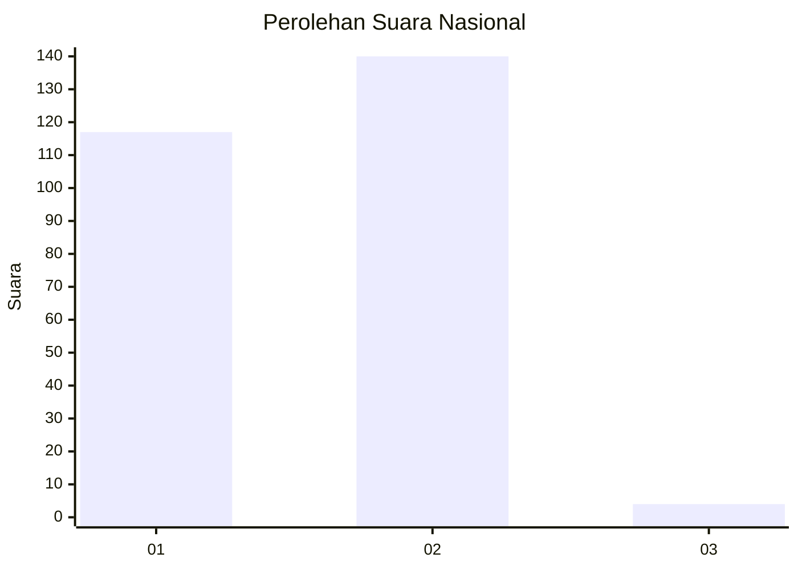
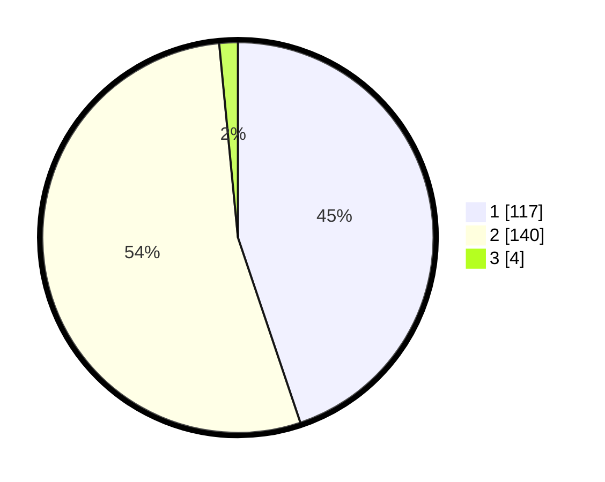

# Hasil

## Grafik

## Tabel

| No. | Nama Paslon    | Suara | Suara (raw) | Persentase |
|:--- |:-------------- | -----:| -----------:| ----------:|
| 1   | ANIES MUHAIMIN | 117   | [117][p-1]  | 44,83      |
| 2   | PRABOWO GIBRAN | 140   | [140][p-2]  | 53,64      |
| 3   | GANJAR MAHFUD  | 4     | [4][p-3]    | 1,53       |

[p-1]: https://github.com/gigit-pemilu/pemilu-2024/blob/main/pilpres/hitung-suara/sub/73-sulawesi-selatan/sub/73-kota-palopo/sub/03-wara-selatan/sub/1002-songka/sub/009-tps/sub/paslon-1.txt
[p-2]: https://github.com/gigit-pemilu/pemilu-2024/blob/main/pilpres/hitung-suara/sub/73-sulawesi-selatan/sub/73-kota-palopo/sub/03-wara-selatan/sub/1002-songka/sub/009-tps/sub/paslon-2.txt
[p-3]: https://github.com/gigit-pemilu/pemilu-2024/blob/main/pilpres/hitung-suara/sub/73-sulawesi-selatan/sub/73-kota-palopo/sub/03-wara-selatan/sub/1002-songka/sub/009-tps/sub/paslon-3.txt

## Foto C Plano

https://sirekap-obj-formc.kpu.go.id/d49a/pemilu/ppwp/73/73/03/10/02/7373031002009-20240215-011426--a23ec053-758b-4c31-b2aa-4b28dfdee247.jpg

https://sirekap-obj-formc.kpu.go.id/d49a/pemilu/ppwp/73/73/03/10/02/7373031002009-20240215-074952--0888f6b9-ae0c-4c9a-a27f-9873c2bf9d8f.jpg

https://sirekap-obj-formc.kpu.go.id/d49a/pemilu/ppwp/73/73/03/10/02/7373031002009-20240215-011536--ee342164-fee9-4d49-8711-07250c00b3ca.jpg

## Metadata

| Key        | Value               |
| ---------- | ------------------- |
| Time Stamp | 2024-02-19 12:00:00 |

