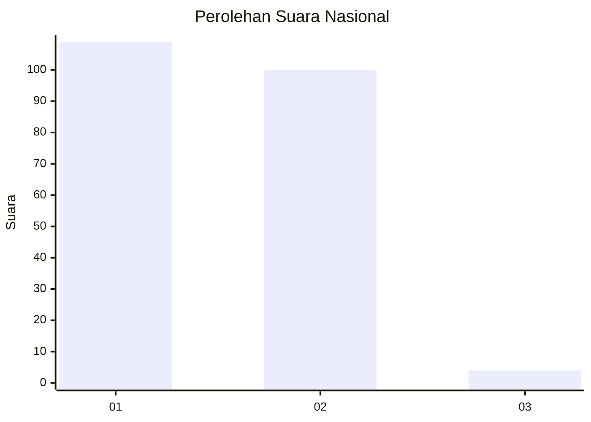
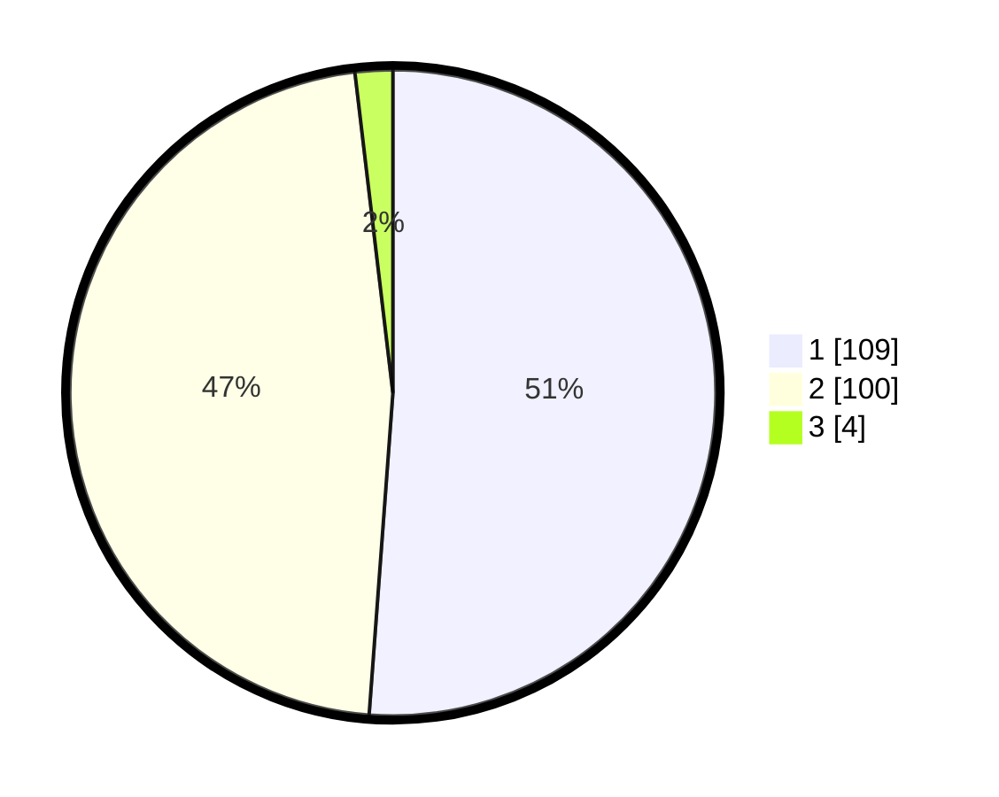

# Hasil

## Grafik

## Tabel

| No. | Nama Paslon    | Suara | Suara (raw) | Persentase |
|:--- |:-------------- | -----:| -----------:| ----------:|
| 1   | ANIES MUHAIMIN | 109   | [109][p-1]  | 51,17      |
| 2   | PRABOWO GIBRAN | 100   | [100][p-2]  | 46,95      |
| 3   | GANJAR MAHFUD  | 4     | [4][p-3]    | 1,88       |

[p-1]: https://github.com/gigit-pemilu/pemilu-2024/blob/main/pilpres/hitung-suara/sub/73-sulawesi-selatan/sub/73-kota-palopo/sub/05-wara-timur/sub/1001-surutanga/sub/003-tps/sub/paslon-1.txt
[p-2]: https://github.com/gigit-pemilu/pemilu-2024/blob/main/pilpres/hitung-suara/sub/73-sulawesi-selatan/sub/73-kota-palopo/sub/05-wara-timur/sub/1001-surutanga/sub/003-tps/sub/paslon-2.txt
[p-3]: https://github.com/gigit-pemilu/pemilu-2024/blob/main/pilpres/hitung-suara/sub/73-sulawesi-selatan/sub/73-kota-palopo/sub/05-wara-timur/sub/1001-surutanga/sub/003-tps/sub/paslon-3.txt

## Foto C Plano

https://sirekap-obj-formc.kpu.go.id/db62/pemilu/ppwp/73/73/05/10/01/7373051001003-20240215-013804--23e56cfe-f522-404a-a483-ebec205090b7.jpg

https://sirekap-obj-formc.kpu.go.id/db62/pemilu/ppwp/73/73/05/10/01/7373051001003-20240215-014313--24f78cb6-c0f4-4549-a8ce-edd218ff3686.jpg

https://sirekap-obj-formc.kpu.go.id/db62/pemilu/ppwp/73/73/05/10/01/7373051001003-20240215-014458--7c215278-4158-486c-b960-75d8ec3fe183.jpg

## Metadata

| Key        | Value               |
| ---------- | ------------------- |
| Time Stamp | 2024-02-19 12:00:00 |

